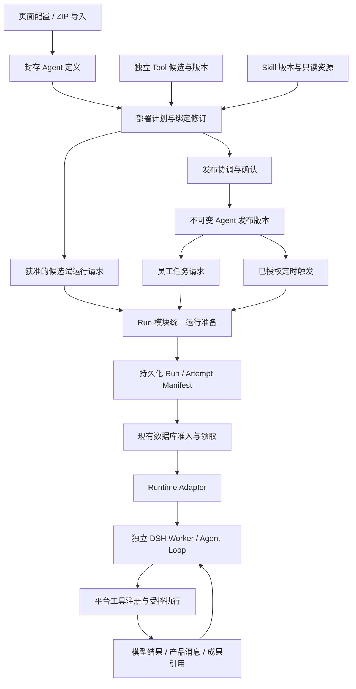

# 企业内部智能体与工具开发、发布及自动化方案

**状态：** 分阶段实施中。AG-00 契约、AG-01 Agent 管理首版均已按调整范围收口：管理端主线（候选/检查/真实 DSH 试运行/逐项确认/提交-退回-撤回/事务内发布/版本证据/启停/回滚）代码交付并通过 P1 集成验证，管理端 API 为当前实现基线；剩余功能项经评审移出本期（见 §16.1 注记与 §17.1），真实环境 P2 验收转挂为发布前门禁、尚未执行。AG-02 工具扩展、AG-03 自动任务、AG-04 经验积累尚未实施。当前实施进度见 §17.1；本文其余部分仍是目标设计，不代表全部能力已实现。<br>
**更新日期：** 2026-09-15<br>
**产品定位：** 员工通过配置已有能力或导入内部规范包创建智能体，dsh-work 负责验证、发布、运行和治理，供企业员工按权限使用。<br>
**首个交付：** 使用已有工具完成 Agent 创建、真实试运行、发布、升级、回滚与停用；卸载、紧急撤销等生命周期余项经评审移出本期（见 §16.1 注记）；新工具贡献、定时任务、经验积累分别验收。<br>
**包与治理边界：** Agent 包可携带 Skill 与受控 Tool 候选；统一展示部署计划，各模块独立维护版本和权限。工具可由管理员单独接入和维护，不依附某个 Agent 的存续。<br>
**迭代边界：** 经验阶段只自动生成候选，由能力负责人确认后发布；不自动修改 Prompt、Skill、业务脚本、工具、权限或模型，不自动发布新版本。<br>
**架构约束：** 员工任务、试运行和经验提炼统一通过 [Run/Attempt → Runtime Adapter → DSH](../development/overview.md#35-agent-执行引擎统一)。平台管理业务流程、权限、持久化和受控工具，DSH 负责单次 Attempt 内的 Agent Loop。<br>
**相关文档：** [内部端口与契约](../development/internal-ports.md)、[Skill 安装方案](skill-installation-plan.md)、[Skill 安装实现](admin-skill-installation-implementation.md)、[Skill Python 执行方案](skill-python-execution-plan.md)、[管理助手交互方案](admin-assistant-plan.md)、[Runtime 执行架构渐进优化方案](runtime-execution-optimization-plan.md)（执行观测、工具适配、上下文延续及后续受控恢复；持久化人工工具审批不作为本方案首版前置条件）。

## 1. 产品目标与判断标准

### 1.1 解决的问题

企业员工掌握具体业务知识和工作方法，但这些能力通常停留在个人经验、文件和重复操作中。dsh-work 让员工把方法开发成可验证、可共享的智能体，帮助其他员工在已有授权范围内，减少系统切换和手工加工，获得可核验、可追溯、可交付的工作结果。

产品主线是：

```text
员工发现业务需求
→ 按内部规范开发智能体
→ 平台验证和部署
→ 负责人确认发布
→ 员工使用或授权定时执行
→ 从获准使用的反馈中提炼候选经验
→ 负责人审核后供后续任务参考
```

平台既不包办所有智能体开发，也不建设外部开发者生态。内部规范、样包和校验入口是降低员工交付成本的手段，不以包数量、协议数量或 CLI 发布作为业务价值证明。

### 1.2 与现有产品的关系

- 员工工作台仍是使用入口，个人与团队 Workspace 仍承载任务、文件、成果及协作上下文。
- 员工增加贡献能力的路径，不因开发智能体而获得管理后台权限。
- Agent 承载业务入口、行为配置和能力组合；Skill 承载方法与受控资源；Tool 提供平台批准的确定性动作。
- 管理后台继续治理工具、连接器、权限、模型、Runtime、容量和审计，不要求平台管理员逐条判断业务经验是否正确。
- 企业知识查询、只读业务查询、文件分析与成果交付仍是首版业务边界。开发智能体可以随包提交受控 Tool 候选，但执行器类型、端点、凭据、数据范围和发布由平台批准；这不等于员工自行安装 Tool/Connector，也不等于允许写入 ERP/MES。

### 1.3 贯穿验收的业务旅程

以“订单汇总与回款分析”为示例，而不是预设已经存在的真实业务需求：

1. 员工甲提交包含分析方法、批准的工具引用和合成测试案例的智能体包。
2. 平台完成隔离试运行，负责人检查金额口径、来源和交付文件后发布。
3. 员工乙在自己的工作空间使用智能体，甲的权限和私人文件不会随能力一起共享。
4. 乙确认任务有重复价值后，设置按自身权限执行的周期任务。
5. 乙指出“订单金额不等于实际到账金额”，并明确同意将经过筛选的纠正用于指定范围的经验提炼。
6. 平台生成方法性候选经验；负责人审核发布后，后续任务可以参考统计口径，但不能把客户具体欠款金额写入全员共享经验。

正式试点前由业务负责人选定真实场景、权威数据源和验收口径。工程样例通过不能代替业务需求及效果验证。

### 1.4 本次修订的完整覆盖

六项管理要求和四项架构调整一起构成本方案，不能只实现页面入口而保留相互依附的数据与执行规则。

| 类别 | 决策 | 落实章节 |
| --- | --- | --- |
| 管理 1 | 配置创建与 ZIP 导入归一为同一草稿、检查、试运行和发布流程 | §5、§6、§13 |
| 管理 2 | 草稿、已发布版本、启停状态分开；明确升级、回滚、紧急撤销和卸载 | §4、§6.5 |
| 管理 3 | 工具可随包提交，也可由管理员独立接入、测试、升级及停用 | §8、§11、§12 |
| 管理 4 | 按变更影响决定验证和审核；测试准入与正式发布批准分开 | §6.3、§7 |
| 管理 5 | 最小稳定包规范、平台逻辑能力标识及必要样例 | §5、§8 |
| 管理 6 | Agent、工具扩展、自动任务和经验积累独立交付 | §2、§15—§17 |
| 架构 1 | Agent 定义、环境绑定和 Attempt 快照职责分开 | §4.1—§4.3、§11 |
| 架构 2 | Tool 模块拥有工具生命周期，发布协调只管理联合提交的一致性 | §4.4、§6.4、§8 |
| 架构 3 | 普通运行、真实试运行和定时执行复用统一运行准备流程 | §4.3、§7、§9、§12 |
| 架构 4 | Tool 定义、环境绑定、执行器和结果投影通过平台注册机制衔接 | §8.2—§8.4、§12 |

## 2. 交付范围与非目标

### 2.1 分阶段范围

| 交付 | 包含 | 独立验收边界 |
| --- | --- | --- |
| AG-01：Agent 管理首版 | 配置创建、ZIP 导入、已有 Skill/Tool 引用、支持格式的包内 Skill、真实 Agent 试运行、负责人发布、共享目录及完整生命周期 | 至少一个使用现有工具的业务能力由另一员工按自身权限使用；不等待新执行器、定时或经验模块（本期已按管理端范围收口，移出项与 P2 门禁安排见 §16.1 注记/§17.1） |
| AG-02：工具扩展 | 管理员独立添加工具、员工随 Agent 包提交受控候选、测试准入、独立 Tool Version、联合发布和复用 | 一个业务所需的新工具在批准绑定下经 DSH 真实调用；不要求同时完成全部协议与沙箱类型 |
| AG-03：定时自动任务 | 本人身份、固定版本、每日/每周、立即运行、暂停、取消、幂等与恢复 | 独立完成自动任务验收；可以使用 AG-01 的已有工具 Agent，不依赖经验模块 |
| AG-04：经验积累 | 获授权反馈、DSH 提炼候选、负责人审核、经验版本、权限检索与撤回 | 候选不会自动生效，也不自动改写 Agent 或扩大权限；不依赖定时模块才能提炼 |

AG-00 先冻结最小契约，详见 §15。AG-01 上线前不开放尚未完成的 Tool 候选执行入口；对包含新 Tool 的包明确显示所缺能力。已有工具的 Agent 可以独立交付，包含新工具的 Agent 必须等其工具适配与证据完成。

员工可以在本地使用自己的开发工具，但平台只接受内部规范定义的交付物。开发过程不提供生产凭据、生产主机登录权限或任意执行入口。

### 2.2 本方案不做

- 外部开发者生态、公共 Registry、开放市场、跨企业 SaaS、通用跨框架转换和对外兼容认证体系。
- 把远程自主 Agent 当成 Tool 接入，或托管员工自带模型调用循环的独立服务。
- 员工上传任意 Tool 实现、自带执行器类型、安装 Connector/MCP Server、执行宿主机安装脚本、任意 Shell、SQL 或网络请求；Tool 候选仅限本方案定义的接口封装与受控沙箱代码两类。
- 自动改写 Prompt、Skill、业务脚本和平台代码；模型训练、微调、自动扩权或无人确认的自动发布。
- ERP/MES 写操作和依赖持久化人工工具审批的无人值守任务。
- 具名能力包组合（tool bundle、connector policy bundle、agent template）。首版使用扁平的精确能力引用与部署单元；当同类组合重复出现时，再作为规范演进项评审。
- 为上述逻辑边界拆分微服务、建设新的 Agent 执行框架、通用发布工作流引擎或多环境部署管理平台。先复用现有模块、版本记录和短数据库事务。

Webhook、通用业务事件触发、Agent DAG、服务主体、委托他人执行、活动版本自动跟随、任务排队替换策略和多节点调度均不进入首版，需要独立需求与安全评审。本方案不预设后续一定建设这些能力。

内部来源不等于可信内容。收缩生态范围不能取消包完整性检查、来源记录、权限校验、隔离执行或企业既有制品安全要求。

## 3. 用户职责与权限

### 3.1 职责划分

| 职责 | 可做的事 | 不因此获得的权限 |
| --- | --- | --- |
| 使用者 | 使用已授权智能体、管理本人任务、查看本人可访问成果、提交反馈 | 开发者的角色、凭据、私人对话和数据范围 |
| 开发者 | 创建和维护本人智能体草稿、上传含 Tool 候选的包、查看本人检查与试运行、提交审核 | 平台管理写权限、自行批准工具端点/凭据/执行器、修改他人智能体、直接全员发布 |
| 能力负责人 | 在被授权负责的智能体上验收业务效果、确认发布、审核经验、处理退回和维护 | 读取所有员工原始业务数据、批准工具接入、扩大工具或数据权限、代替其他用户运行 |
| 平台管理员 | 分配治理权限和负责人、审核 Tool 候选、配置连接器与凭据绑定、约束共享范围和配额、停用能力 | 自动获得员工私人内容读取权或跳过业务验收 |

使用者、开发者和负责人是职责划分，可以由同一员工承担；发布仍是独立确认动作。需要双人复核的企业可进一步收紧策略，但不能通过自动确认代替负责人验收。

### 3.2 授权规则

- 员工开发、负责对象和发布能力使用本地细分权限与对象关系，不通过向员工发放 `admin:write` 实现。
- 身份和操作人由服务端建立；包中的作者、负责人、角色、数据范围均是声明或申请，不是授权事实。
- 新建草稿默认仅开发者可管理。负责人分配需要受控流程；不能仅凭请求体指定自己为其他智能体的负责人。
- 负责人确认业务结果，平台同时检查其发布权限、对象责任关系及允许的共享范围。
- 发布到企业内部目录只共享能力。公开卡片仅含批准的介绍和使用说明，不自动公开 Prompt、源码、测试文件、对话和经验来源。
- 执行仍校验当前用户、Workspace 成员关系、Agent/Skill/Tool、数据范围和成果权限。同一智能体对不同员工使用不同的有效授权。
- 首版自动任务仅能以创建者本人身份执行。能力负责人、平台管理员均不能通过填写另一个 `run_as_id` 代替员工授权。
- 开发者或负责人离职后保留版本与审计，冻结其待处理发布并走负责人移交流程。自动任务执行身份不得随负责人变更自动替换。

## 4. 核心对象与架构

### 4.1 定义、环境绑定与执行快照

保留 Node.js 模块化单体和每 Attempt 独立 DSH Worker。以下是逻辑职责，不要求一一新增服务、模块或物理表。

| 对象 | 负责的事实 | 生命周期与边界 |
| --- | --- | --- |
| Agent 定义版本 | 业务目标、Prompt、输入输出说明、逻辑 Skill/Tool 引用、限制申请、案例和内容摘要 | 可由配置页面生成或 ZIP 导入；不包含企业用户 ID、平台数据库 ID、凭据、宿主路径和定时规则 |
| 环境绑定修订 | 平台批准的 Tool/Connector 绑定、数据源槽位、执行环境、授权上限与平台策略引用 | 属于平台配置；封存后不可覆盖，变化形成新 revision，按影响重新验证 |
| Agent Version（平台发布版本） | 定义版本、精确依赖闭包、绑定修订、验证与确认依据的固定组合 | 普通 Session 与自动任务引用它；保持现有 Agent Version 作为运行引用入口，不额外要求客户端理解第二种 Release ID |
| Agent 管理记录 | 负责人、当前默认发布版本、可变草稿指针、启用/停用/归档及可见范围 | 草稿与可用性独立；编辑草稿不改变已发布的运行内容或员工目录说明 |
| 部署提交 | 某次配置或包导入、依赖解析、绑定申请、检查、审核及 revision | 管理候选和来源，不承担 Tool 的永久所有权；提交完成后发布版本仍有完整独立引用 |
| Tool 候选 / Tool Version | 独立工具定义、Schema、实现摘要、执行器类型及权限要求 | 由 Tool 模块管理；候选可有包来源，也可由管理员直接创建；Agent 只引用精确版本 |
| 测试准入记录 | 特定封存候选在指定测试身份、绑定、环境和期限内的执行许可 | 不等于正式发布；不能用于普通任务，修改候选或授权范围使旧许可失效 |
| Session / Run / Attempt | 产品对话、用户任务、一次执行的不可变 Manifest 和结果 | Manifest 记录真实执行主体、当前有效授权、实际路由、输入和精确版本；不复用开发者权限 |
| 自动任务 | 固定发布版本、本人身份、输入与日历规则 | 独立于 Agent 包与发布；修改频率不重新发布 Agent |
| 经验候选 / 经验版本 | 获准提炼的材料、审核事实及可引用的参考内容 | 与 Agent 发布独立；每次 Attempt 固定实际引用，不能成为工具授权来源 |

定义版本与平台发布版本不能混用：包的 `metadata.version` 是作者声明的 SemVer；`agentVersionId` 是平台精确运行引用。同一内容在不同环境可形成不同绑定；同一目标环境切换绑定也必须生成新的平台发布版本，不能覆盖旧版。绑定变化不要求作者无意义地修改包版本，但定义内容变化必须更新来源版本。

首期可在现有 `agent_versions`、发布记录和提交快照上增加内容引用、绑定 revision、精确依赖及证据引用；只有确有独立查询或共享需求时再拆表。发布内容与运行引用须自足，不能依赖一个以后会被编辑或清理的提交 JSON。

### 4.2 平台绑定的归属与变化

- Tool 模块维护工具到批准执行器、Connector、凭据槽位及环境的绑定修订；Agent 发布版本引用这些绑定，不复制维护另一份端点或凭据配置。
- 包只声明逻辑能力和配置槽位。员工选择自己有权使用的已有绑定；新增端点、网络范围、执行环境或授权上限由平台治理流程批准。
- 模型路由仍由平台统一管理，首期沿用平台默认策略。Agent 包不能指定 Provider 凭据或自带模型调用路径；实际路由快照在 Attempt 中记录，策略变化按 §7.4 检查验证影响。
- 绑定封存后不能就地换端点、请求映射、权限范围或环境镜像。相关变化产生新修订，引用新修订的 Agent 走发布流程；旧 Session、自动任务和 Attempt 不静默跟随。
- 凭据只保留受管引用。相同授权语义下的凭据轮换先验证可用性，不修改包正文；账号主体、授权范围或数据过滤变化按绑定语义变化处理。
- 当前身份、对象授权、依赖撤销及健康状态属于执行时检查。固定绑定和历史测试通过均不能绕过当前收权，也不保证某端点永远在线。

### 4.3 统一运行准备

将依赖解析与 Manifest 准备整理为 `modules/run` 内的共用应用流程，通过现有模块端口读取定义、绑定和权限。它完成确定性准备，不执行推理、决定工具调用顺序或维护第二套 Agent Loop。



该图表示职责与数据依赖，不表示必须在创建 Run 之前完成所有准备。沿用现有 Run 受理及失败收敛，在持久化准备阶段固定以下事实：

1. 从服务端确认的用途选择已发布版本，或读取有有效测试准入的封存候选。浏览器和包不能通过传 `purpose` 切换到草稿、管理工具或其他身份。
2. 解析精确 Skill/Tool 闭包和绑定修订，检查内容完整性、兼容性、依赖可用性及来源权限。缺少必需工具时明确失败，不静默删掉依赖继续运行。
3. 由身份与授权模块计算实际执行者、Workspace、对象权限与有效范围，且不超过发布或测试准入的上限。Skill 不静默扩大 Agent 的 Tool Allowlist。
4. 准备有权读取的输入、知识、历史与经验引用，取得平台模型路由和运行限制；通过 Tool/Runtime 端口把平台逻辑能力映射为本次 DSH 描述与处理器。
5. 构建并持久化不可变 Attempt Manifest；准备失败记录明确阶段。领取和工具调用仍复核当前授权，不能把准备快照当成永久许可。

普通任务、Agent 试运行、定时执行复用这套流程；区别限定在版本可见性、可信执行身份、输入和目的授权。管理助手和经验提炼也复用底层准备机制，但保持独立管理用途的权限限制。不得每增加一个业务 Agent 就增加专用后端分支。

现有 `getRuntimeSnapshot` 同时读取 Agent 配置、解析 Skill、映射 DSH 工具名并聚合审批模式，Run 服务再合并权限与输入。实现时逐步将通用准备放到 Run 应用层，具体解析留在所属模块；Adapter 保留 ACP 传输、资源准备、进程、取消、事件和工具桥职责，不读取部署审核状态决定是否发布。

### 4.4 独立能力与联合发布

Tool 模块拥有候选、测试准入、定义与绑定修订、批准和生命周期；Skill 模块拥有安装解析、资源与版本；Agent 模块拥有业务定义、负责人、发布版本和目录可用性。来源包关联只用于追溯与联合计划，删除 Agent 不能级联删除共享工具。

联合包由轻量发布协调流程调用各模块端口：汇总已批准的变更，在同一个 PostgreSQL 短事务中复核并发布必要版本与引用。协调流程可放在现有 Agent 应用层，但不能绕过 Tool/Skill 的领域门禁直接修改其表。独立 Tool 发布也使用 Tool 模块同一门禁，详见 §6.4、§8。

原子发布保证一次部署的可见性一致，不表示所有能力共用所有者、启停状态或删除生命周期。首期不增加分布式事务、消息总线或可任意编排的发布引擎。

### 4.5 当前实现与目标变化

| 当前依据 | 本方案的目标增量 |
| --- | --- |
| [Agent 服务](../../server/src/modules/agent/postgres-agent-service.ts) 旧 `testAgent` / `POST /agents/test` 只保存配置引用检查（已实现：入口已下线，历史 `agent_test_runs` 行仅作配置检查留痕） | 配置检查与真实 DSH 试运行证据分开；旧 `passed` 不升级成真实证据 |
| 同一服务的停用分支曾在存在草稿时拒绝操作（已实现：停用/启用与草稿独立，管理状态优先于草稿外观展示） | 管理状态与候选状态独立；紧急撤销仍不受草稿阻挡（紧急撤销本身待实现） |
| [Run 编排](../../server/src/modules/run/run-orchestration-service.ts) 已按 Agent 版本通用构造运行输入 | 提取共用准备端口，补齐封存候选及后台身份路径；保留已有通用执行结构 |
| [Runtime Adapter](../../server/src/modules/runtime/dsh-acp-runtime-adapter.ts) 逐项装配平台工具处理器 | 通过受控注册入口供给已授权描述与处理器，新增已有类型工具复用接线 |

以上只列实际核对的边界，不把“包写死凭据”“每个业务 Agent 都需要新分支”当作已经存在的事实。新规范预防这些耦合，当前确有的问题则纳入对应阶段修复。

## 5. 创建入口与最小交付规范

### 5.1 两种创建入口，一套候选与发布流程

| 入口 | 适用场景 | 平台处理 |
| --- | --- | --- |
| 配置创建 | 定义任务目标、行为说明、所需输入、已有 Skill/Tool 和业务案例 | 生成规范化定义与内容文件，进入同一部署提交、依赖检查、真实试运行和发布门禁 |
| ZIP 导入 | 本地开发 Prompt、Skill、参考资料，或在工具扩展阶段携带自定义 Tool 候选 | 安全解包、规范化和保存内容，进入相同流程；不执行安装钩子 |

两者只影响输入方式，不维护两套 Agent 类型。配置页面生成的定义可按源码读取/导出权限导出标准包；复杂包含页面不支持编辑的字段或文件时保留原内容，提示以新包更新，不能默默丢弃。

“从已有 Agent 复制”可在首版之后作为配置入口的快捷操作，不要求建设模板市场。复制必须具有定义/源码复制权限，目录可见或可执行权限不足以允许复制。复制创建本人新草稿，仅带获授权的定义与依赖声明，企业绑定重新选择，不复制凭据、业务文件、运行历史或他人的授权。

### 5.2 最小包与可选目录

员工交付平台声明式能力，不交付独立服务、容器镜像或常驻进程。最小包只要求：

```text
agent-package/
├── agent.yaml
├── prompts/system.md
└── evals/cases.yaml
```

复杂能力按需要增加：

```text
skills/<name>/SKILL.md             # 复用现有 Skill 规范
skills/<name>/references/         # 可选参考文件
skills/<name>/scripts/            # 平台支持的受控脚本
tools/<name>/tool.yaml            # AG-02 的工具候选
tools/<name>/schemas/             # 工具输入输出 Schema
tools/<name>/handler.py           # 仅沙箱代码类型需要
tools/<name>/tests/               # 工具测试输入与断言
checksums.json                   # 可由打包工具生成，也可由平台生成
```

- `agent.yaml` 是唯一 Agent 入口，声明名称、目标说明、版本、行为文件、能力引用、运行上限申请和案例入口。
- 无 `path` 的依赖必须使用明确命名域的逻辑名称与版本约束，从有权使用的已发布版本解析。带 `path` 的依赖只在该包内解析，再由所属模块分配或复用精确候选版本；不按重名回退到其他人的对象。
- 包内 Skill 复用现有解析、依赖图、资源存储和严格试运行，不另写解包与脚本执行链路。
- Tool 候选限于固定企业接口封装或受控沙箱代码，规范与注册流程见 §8。新增执行器或不兼容依赖显示能力缺口，不在宿主机安装或回退执行。
- 发布所需案例至少包括成功、缺失/无效输入以及相关权限拒绝场景。需要引用文件时使用合成或明确批准的测试材料；开发包不携带生产凭据与私人业务数据。
- 平台提供最小有效样包、带依赖样包、常见拒绝样例和校验入口。校验和清单可自动生成，不把人工计算摘要、独立 CLI、公共 SDK 或开发者认证作为交付前提。

### 5.3 Manifest 草案与能力命名

以下仅是待实现契约示例，当前接口不因此支持导入：

```yaml
apiVersion: dsh-work.ai/v1alpha1
kind: AgentPackage
metadata:
  id: order-summary
  name: 订单汇总助手
  version: 1.0.0
  description: 按明确统计口径分析授权订单文件并输出带来源的汇总
spec:
  systemPrompt: prompts/system.md
  tools:
    - id: platform/read
      version: ^1.0.0
  requestedScopes:
    - workspace:authorized
  limits:
    timeoutSeconds: 300
    maxOutputTokens: 12000
  evaluation:
    cases: evals/cases.yaml
```

该最小示例只要求读取输入并在对话中输出结果。需要生成文件时必须另声明批准的文件写入工具；不能因为描述写了“输出文件”就自动获得写权限。数值是申请上限，平台可以收紧，不能放大现行 Runtime 契约的上限。

带本地 Skill 或 Tool 时，在同一 `spec` 增加相应条目；无需创建另一种 Agent 类型：

```yaml
# spec 内的可选字段示例
skills:
  - id: order-summary
    version: 1.0.0
    path: skills/order-summary
tools:
  - id: platform/read
    version: ^1.0.0
  - id: query-orders-api
    version: 1.0.0
    path: tools/query-orders-api
```

采用稳定的平台逻辑标识：`platform/read` 表示平台公开工具契约，解析为例如 `read@1.0.0` 的精确 Tool Version，再由平台注册映射到当前 DSH 工具描述。来源命名域、平台对象 ID 和 DSH 内部名称分别记录，不能因为字符串碰巧相同就省略映射。

> 当前实现：已交付的包格式为扁平 `agent.yaml`（`id/name/version/system_prompt_file/tools/skills` 等顶层字段），能力引用直接使用 `id@version` 字面形式，无 `apiVersion/spec` 分层与逻辑命名域；上示契约仍为演进目标，逻辑标识映射层待确有跨命名域别名需求时引入。

确需表达非 Tool 的 Runtime 特性时，拟使用顶层 `compatibility.requiredCapabilities`，例如 `skill.activation.v1`。该标识属于平台能力契约，由平台映射并验证当前 DSH Lock；不直接把 DSH Profile 内部方法名作为包字段。声明能力只用于检查兼容性，不授予调用权。`activate_skill`、`python_execute` 等运行时辅助工具是否注入，继续由平台依赖和授权规则决定。

### 5.4 规范语义与兼容性

| 分类 | 必须明确的规则 |
| --- | --- |
| 规范版本 | `apiVersion` 标识格式版本；不支持的版本、未知字段和不支持的能力明确拒绝，禁止静默换语义 |
| 身份与命名域 | 新对象归属由服务端当前开发身份决定；包 ID 在该命名域内解释，升级要明确目标对象及维护权限 |
| 来源版本 | 作者 SemVer 与平台精确版本分开；同一目标命名域的已登记来源版本不能对应不同内容，内容变化需新来源版本 |
| 依赖 | 检查完整闭包、循环、冲突及工具授权；在计划中固定解析结果，不在运行时再按版本范围寻找最新版 |
| 定义与绑定 | 包保存逻辑声明和槽位申请；实际端点、凭据引用、企业权限与执行环境属于平台绑定修订 |
| 工具类型 | 执行器类型为平台枚举；包不能提交动态加载器、安装脚本、任意可执行体或第二套模型循环 |
| 测试与证据 | 本地格式校验不代表平台授权、连接器可用或真实业务验证；案例与证据分别保存摘要和引用 |
| 经验与自动任务 | 经验仅可声明接受审核后参考；提炼授权、经验发布、定时规则和执行身份都独立管理，不随导入隐式启用 |

平台对全部允许文件计算规范化内容摘要，并另存原 ZIP 摘要；若包携带 `checksums.json`，必须完整匹配除自身外的文件，缺失、额外或摘要冲突均拒绝。无清单时平台生成权威索引，不能省略完整性检查。格式检查不能替代企业制品扫描与隔离验证。

### 5.5 包、文件与数据库的保存方式

开发和生产均以 macOS 的受控数据目录为基线。源包、Prompt 文件、Skill Markdown、脚本、Schema 和案例文件保存在文件存储；PostgreSQL 保存治理元数据、内容引用、摘要索引、精确依赖、绑定修订和状态，不保存这些包文件的正文或二进制副本。

拟沿用内容寻址模式，目录示意如下；最终存储键由平台生成，路径不成为外部包契约：

```text
DSH_WORK_DATA_ROOT/
├── agents/<content-sha256>/       # 规范化 Agent 定义及其文件
├── skills/<content-sha256>/       # 复用已有 Skill 内容目录
├── tools/<content-sha256>/        # 独立 Tool 定义及受控代码
└── uploads/<opaque-key>.zip       # 如按保留策略保存原始上传包
```

- 配置页面生成的 Prompt、案例等同样落入内容存储。用于搜索、列表和授权的结构化字段可建数据库索引，但文件内容的权威来源只有受控文件引用。
- 包先进入暂存区，限制压缩展开量、路径、符号链接、文件类型和数量，按现有 Skill 安全规则校验；成功后原子落盘为不可变目录，再提交数据库引用。
- 执行时仅装载已锁定、有权读取的资源。包内容只读，输入和成果使用当前平台工作区契约；沙箱内可用路径与宿主路径不同，不能写死在可移植定义中。
- 相同内容可复用存储，但内容摘要不是访问凭证；源码、测试材料、历史成果仍分别鉴权。包随 Agent 发布不自动公开源码或测试文件。
- Agent 卸载移除可使用入口并保留引用历史；文件回收需检查所有版本、提交、测试和 Run 引用及保留期。共享 Tool/Skill 和被历史运行引用的文件不得级联清理。
- 数据库和数据目录成组备份、校验与恢复。本次方案更新不迁移或清理当前业务数据，具体新增索引和已有记录补全在对应实施阶段执行。

## 6. 发布、升级与独立生命周期

### 6.1 发布的含义与完整旅程

安装是把内容变成可追溯的受管候选；发布是把已验证的定义、精确依赖与环境绑定登记为可使用的不可变版本。使用时由平台创建 Run/Attempt，再交给 DSH。Agent 无需各自常驻服务，也不以加载任意 Python 插件的方式取得平台执行权。

1. **创建候选：** 页面配置已有能力或上传 ZIP，服务端记录开发者、目标对象、来源和 revision。
2. **自动检查：** 检查格式、文件、摘要、依赖闭包、执行器与 Runtime 兼容性；失败指出字段和处理方式，保留可修复草稿。
3. **查看计划：** 展示新建/复用/升级的 Agent、Skill、Tool，精确依赖图、所需绑定、授权申请及对现有调用者的影响。已有依赖不重新安装，缺少能力明确阻塞。
4. **绑定与准入：** 选择有权使用的已有绑定。涉及新 Tool、端点、执行环境或权限扩大的部分按 §7.2 取得测试准入；只有已有批准能力时不额外要求工具管理员逐次确认。
5. **真实试运行：** 封存候选、绑定和案例，走共用 Run/Attempt → Adapter → DSH；新 Tool 先完成其模块验证，再参与 Agent 联合验证。
6. **提交与验收：** 提交绑定同一内容与证据指纹的申请。负责人检查业务输出和使用边界；仅涉及工具接入或权限变更的部分需要对应平台批准。
7. **确认发布：** 服务端按 §6.3 确认所需批准，事务内复核当前权限、revision、摘要和依赖；发布不可变版本与引用，返回确定结果。
8. **员工使用：** 目录显示批准的介绍和可用状态，其他员工在自身 Workspace 和授权下执行；开发资料和私人数据不随之公开。
9. **持续维护：** 修改定义产生新候选，修改绑定产生新修订；通过影响检查后发布新平台版本。新 Session 使用默认版本，已有 Session 和自动任务保持其精确版本。

负责人发布确认是独立动作，但不为同一事实机械增加多次点击。前期已批准的工具或环境决策，在摘要、范围与有效性均未变化时可复用；最终发布仍需真实证据和事务复核。自动任务启用、经验来源授权和经验发布均另行明确确认。

### 6.2 提交状态与管理状态

| 提交状态 | 允许操作 | 约束 |
| --- | --- | --- |
| `draft` | 配置/导入、检查、绑定、试运行 | 内容修订使相关证据失效，不能影响当前发布版 |
| `submitted` | 负责人检查、退回、确认发布；开发者撤回 | 内容、绑定、依赖与证据封存，不能边审核边改写 |
| `changes_requested` | 修订后重新提交 | 新 revision 使旧确认失效；新包遵守来源版本规则 |
| `published` | 查看记录、创建下一次提交 | 发布版本有独立引用，不再依赖可变草稿 |
| `withdrawn` | 查看记录、创建新提交 | 不能凭已撤回提交直接发布 |

Agent 管理界面分别显示“当前发布版本”“已启用/已停用/已归档”“有无待发布草稿”，不能用一个 `status` 混合表达三件事。开发中可以没有发布版本；已启用 Agent 可以同时有草稿；有草稿仍可停用或撤销发布版。

首期每个 Agent 保留一个可变候选；试运行使用该候选的封存修订，后续编辑不得改写已运行的修订。负责人移交不改变历史内容或自动任务的执行身份；离职后的候选发布冻结，保留历史后按授权移交。

> 当前实现：状态机已在管理端落地——`submitted` 期间候选封存（案例/依赖/检查/试运行/ZIP 重导均拒绝，草稿漂移只标记 `definitionChanged` 不推进修订），退回必须填写意见转 `changes_requested` 解除封存，撤回转 `withdrawn` 终态并保留历史，发布仅允许 `submitted` 且要求封存修订与逐项确认通过的试运行一致。“开发者/负责人”两角色暂由平台管理员兼任，按对象授权审核待员工自助入口实施。

### 6.3 按变更影响确定审核

| 变更 | 验证与确认 | 不需要附带的操作 |
| --- | --- | --- |
| 新建 Agent，或修改目标、Prompt、Skill/Tool 组合 | 当前配置检查、受影响真实案例、业务负责人确认；依赖与绑定须已批准 | 仅引用既有批准能力时，不新增工具接入审核 |
| 新 Tool、Schema/实现、端点、环境或权限扩大 | 对应工具/绑定的准入与发布批准、受影响工具及 Agent 验证、业务确认 | 不重审未变化的公共工具和不相关 Agent |
| 已批准绑定切换或精确依赖升级 | 检查差异、目标环境与相关业务证据，生成新平台发布版本 | 不要求重写未变化的源包，也不强制重新安装已有依赖 |
| 仅目录展示字段 | 内容/权限及页面检查，留下修订记录 | 确认字段未进入 Prompt、检索描述或其他运行输入后，可复用运行证据；改动包文件仍遵守包版本规则 |
| 定时规则 | 预览日历与时区、当前权限及本人确认 | 仅频率变化不重新发布 Agent；输入、范围等执行条件变化按 §9 重验 |
| 审核经验 | 来源与共享校验、负责人审核及必要案例对比 | 已批准引用策略内的经验发布不重新部署 Agent |
| 普通停用或紧急撤销 | 当前治理权限、明确影响范围及生命周期动作 | 不要求先发布草稿或补齐业务试运行，不能让安全处置被发布门禁阻挡 |

影响范围由平台根据结构化差异判断，不能由调用者自报“仅文案”跳过检查。证据是否能复用按 §7.4 判断；共享范围或授权上限扩大始终检查对应当前治理资格与数据访问边界。

### 6.4 原子发布、幂等与回滚

- 同一请求幂等返回同一提交或发布结果；同一幂等键替换内容拒绝。来源名称/版本/内容相同可复用已登记对象，不能重复创建；同版本不同内容拒绝。
- 升级需要明确可维护目标和预期 revision；包内名称或 ID 不代表对已有 Agent、Skill 或 Tool 的所有权。
- 封存时由各模块保留精确候选版本引用、内容摘要与绑定修订。试运行只可读取准入明确列出的版本；普通任务仍限于已发布版本。
- 新 Tool 可先独立发布，也可与 Agent 联合发布。若独立发布的仍是同一封存版本及绑定，可按 §7.4 复用证据；不能仅凭同名就替换测试对象。
- 文件内容先校验并原子落盘，再进入短数据库事务。发布协调按稳定顺序锁定目标、候选与依赖，通过各模块事务端口复核批准、内容、可用性与引用关系；事务中不下载文件、调用 DSH、请求外部系统或等待人工审核。
- 同一事务写入需要新发布的 Agent/Skill/Tool 版本、绑定引用和发布事实，并更新 Agent 默认版本指针。已发布依赖仅引用；任一复核失败则本次新增可见版本全部回滚，已独立发布的依赖保持原状。
- 不把文件系统与 PostgreSQL 称为同一事务。数据库提交失败可能留下无引用内容，按保留与回收机制清理；数据库已提交但响应丢失时用幂等键返回结果，不能重发一组版本。
- 通知、目录刷新等后续动作从持久化发布记录重试，不回滚已经提交的版本，也不重新执行试运行。
- 回滚切换到依赖仍有效、目标环境证据满足要求的历史平台版本，不覆盖内容。回滚影响新 Session 的默认选择；既有 Session/自动任务的版本迁移需要单独确认。若必须停止故障旧版的继续使用，对该版执行撤销规则。

### 6.5 启停、撤销与卸载的行为

表中“新执行”包括新 Session、已有 Session 新一轮、失败重试及定时触发；历史记录读取按原权限保留。普通升级不属于撤权。

| 操作 | 新执行与排队 | 运行中的 Attempt | 历史、草稿与依赖 |
| --- | --- | --- | --- |
| 发布/升级 | 新 Session 采用新默认版；已有 Session/定时保持精确版本，排队快照不改写 | 使用原快照继续 | 旧版留存；Agent 启停状态不会被草稿修改隐式改变，停用期间发布不自动重新启用 |
| 普通停用 Agent | 阻止该 Agent 的全部新执行；取消尚未开始的准备/排队记录，关联自动任务暂停 | 在当前授权仍有效时允许完成，界面显示排空中；用户可另选取消当前任务 | 可查看历史和编辑草稿；不删除、不停用共享 Tool/Skill |
| 紧急撤销 Agent/指定版本/Tool/绑定 | 立即阻止受影响范围的新执行与领取，取消队列并暂停相关自动任务 | 发出取消，拒绝后续工具调用，超时回收 Worker；已发生动作不能声称被撤销回滚 | 保留证据与关联；可以只撤销故障版本，不必停用其他健康版本 |
| 重新启用 | 检查当前权限、依赖、绑定及有效证据后允许新执行 | 不复活旧终态 | 不自动恢复已暂停的定时任务，需任务所有者重新确认 |
| 卸载 Agent | 从可用目录移除，阻止新执行并取消队列，关联自动任务暂停 | 按普通停用排空；需要立即结束时明确执行紧急撤销 | 归档 Agent 管理记录；保留历史版本、Run、成果与引用，不级联删除 Skill/Tool |
| 丢弃未发布草稿 | 不能再从该候选启动试运行，取消未开始的候选任务 | 如有候选试运行先取消并收敛 | 只移除可变候选入口；已封存测试记录按保留策略保存，不影响发布版 |

首次发布默认启用属于发布确认摘要中的明确动作。已停用 Agent 发布新版本时保持停用；重新启用复用同一领域校验，不能因为页面有新草稿就自动发布或启用它。

普通停用是准入控制，允许已运行任务排空；身份或数据授权撤销是即时安全收权，两者不能混用。排队领取与停用/撤销存在并发时，必须通过当前可用性修订复核保证确定结果；撤销后的迟到事件不能把取消/失败改回成功。

工具也有独立启停和撤销，影响所有引用它的 Agent。操作前展示受影响的版本、队列和任务范围；普通停用阻止这些依赖的新执行并取消未开始任务，活动 Attempt 在授权有效时排空。不能只处理某一个来源 Agent，也不能为消除依赖错误自动切换 Tool 版本。已批准的对象授权收回始终优先于排空。

“卸载”是停止提供能力并归档，不是物理删除全部文件。只有无任何版本、提交、测试、Run 或成果引用且满足保留策略的内容才可回收；共享资源清理由所属模块负责。重新安装相同未撤销内容可复用受管版本，但恢复可用性仍需当前权限、绑定和证据校验。

## 7. 真实试运行、测试准入与发布门禁

### 7.1 统一试运行链路

当前 `testAgent` 只做配置检查，现有 Skill 严格试运行也不能代替 Agent 整体效果验证。目标流程为：

```text
封存定义、精确依赖、绑定与案例集
→ 静态检查及测试准入
→ 共用 Run 准备流程创建试运行 Session / Run / Attempt
→ Runtime Adapter → 真实 DSH
→ 收集 Skill 激活、Tool 调用、回答和成果证据
→ 案例断言与边界检查
→ 负责人确认同一版本的业务效果
→ 发布事务复核证据和所需批准
```

工具候选自身的 Schema、过滤、超时、取消和隔离检查先由 Tool 模块完成；必要真实调用经同一 DSH 链路验证。工具独立接入可使用平台受控测试配置，不要求创建一个虚假的业务 Agent 才能管理工具。

### 7.2 测试准入与正式发布分开

| 决定 | 批准什么 | 不能据此做什么 |
| --- | --- | --- |
| 测试准入 | 特定候选内容及绑定，在指定测试环境、身份、数据范围、用量和有效期内执行 | 进入正式目录、给普通员工调用，或调用准入之外的草稿 |
| Tool/绑定正式发布批准 | 基于同一内容、绑定和验证结果，允许发布并在批准范围内被引用 | 替代 Agent 业务验收、用户当前数据授权或运行中需要的工具审批 |
| Agent 业务确认 | 负责人确认同一提交、实际输出、适用边界和共享范围 | 扩大工具端点、凭据、执行环境或替其他员工授权 |

已有批准工具与绑定的试运行由平台按当前开发/测试权限和既有规则准入，不要求额外人工审核。新工具或新绑定必须先由平台核准其隔离测试条件，再进行真实试运行；“未正式发布”不等于“可以未经准入执行”。没有有效测试许可的候选，在任何用途都不能执行。

测试准入至少绑定候选精确版本与摘要、绑定 revision、执行器/Runtime 能力、允许的测试身份和 Workspace/数据、用量、期限及批准依据。许可由服务端核验，不接受前端自行声明测试模式。AG-02 新增工具的试运行许可由 Tool 模块维护，来源可以是 Agent 提交或管理员独立工具提交。

测试准入的期限约束执行许可：到期后不能启动或继续未完成测试。已完成的证据不因许可自然到期自动作废，仍按 §7.4 检查内容、环境和批准范围；因安全问题撤销候选或绑定时，应同时阻止其发布与后续使用。

声明式参数引用既有政策即可满足的准入允许确定性处理；新增代码、端点或环境等需平台批准的变化不能因“测试”而跳过治理。正式发布时可以复用未变化的准入资料和审批依据，但必须检查发布范围与实际测试证据；不得把准入状态直接改名为发布通过。

### 7.3 隔离、执行身份与通过标准

- 发起人、测试执行者和业务确认人分别记录；管理权限不是读取员工业务数据的凭证，不向员工提供模拟任意同事身份的入口。
- 工程集成测试使用专用可丢弃 PostgreSQL，不连接开发业务库或生产库。产品真实试运行使用明确的测试空间、合成输入和获准 Connector 测试绑定；仅更换 Workspace 名称不足以隔离真实数据。
- 若在独立验证环境执行，由受信服务端通道回传证据并关联控制面提交与执行环境。客户端上传“通过”或模型宣称已完成，均不能写入有效证据。
- 执行范围限于获准只读业务操作与已有隔离工作区成果处理。测试准入不降低原有工具审批策略；需要尚未接通的持久化人工工具审批时标为不兼容。
- 各案例要求的 Skill 激活、Tool 调用、来源、计算结果和成果都有可观察断言。案例集合覆盖必需能力，不要求不相关案例强行调用所有工具。
- 检查缺失输入、无权访问、连接器故障、沙箱违规和无法安全投影的结果；不能仅凭 Run 成功或最终回复决定通过。
- 生产连接器、真实 OIDC 与不同角色验收按环境流程单独留证；Mock/合成数据通过不能证明真实企业系统通过。

### 7.4 证据、差异与复用

| 证据 | 含义 | 不能代替 |
| --- | --- | --- |
| `configuration_checked` | 内容、引用、绑定及申请策略检查通过 | 实际 DSH 运行或业务验证 |
| `runtime_verified` | 指定环境中真实 DSH、相关 Skill/Tool 及案例断言通过 | 未验证环境、真实连接器或其他角色的保证 |
| `business_accepted` | 负责人确认同一配置和证据的业务结果 | 当前身份授权与持续健康检查 |

证据至少绑定提交/候选 revision、定义与工具实现摘要、精确依赖、绑定修订、案例和测试数据引用、权限档案、Run/Attempt/Manifest 摘要、实际 Runtime Lock/Adapter 协议、模型路由、真实/模拟依赖标记，以及确认人和时间。经验阶段另固定策略和当次实际经验版本。

- 候选版本与内容、输入、权限、绑定、模型/Runtime 或案例发生影响执行语义的变化，重跑受影响检查与案例；未知影响按需要重验处理，不默认通过。
- 证据记录不可改写。复用时保存新提交与旧证据的对应关系、未受影响项和判断依据，不能只复制一个 `passed`。
- 工具候选被独立发布后，只有精确版本、内容、绑定、权限条件和执行语义均与试运行一致时，联合 Agent 才可复用相关证据。重新解析到了另一个版本时需重新封存和判断影响。
- 纯目录展示变更不改动运行输入时可保留运行证据。若名称/描述参与模型上下文或检索，就属于行为变化。不能通过把字段标记成 UI 配置逃避验证。
- 绑定切换、Tool Schema/实现或权限扩大需要相应工具与 Agent 案例验证；不要求所有无关 Agent 全量重测。正常凭据轮换先验证可用性；主体或范围变化属于语义变化。
- Runtime/模型平台策略升级先做兼容与影响检查，保留结果与受影响版本集合。历史证据仍是历史事实，不自动证明新配置可用，也不因短暂端点离线改写为从未通过。
- 测试绑定与拟发布的目标绑定不同时，单凭测试环境通过不足以发布。需记录绑定差异，并补齐目标环境必要的连通、权限、过滤和业务案例证据；不得把 Mock 绑定的结果标记为真实企业连接器验证。
- 已批准经验策略内增加经验走独立审核及必要回归，不自动生成新 Agent Version；扩大策略或权限仍走 Agent 发布。

最终发布事务复核当前治理权限、责任关系、依赖状态和同一证据指纹。发布时的证据引用保留不变，后续目标环境补验以新的关联验证记录追加。证据齐全不代表发布者永远有权发布；源码或包相同也不代表部署环境相同。

### 7.5 历史入口、停用与失败恢复

历史静态 `agent_test_runs.passed` 仅保留为配置检查留痕，不能升级成真实运行证据；其写入口（`POST /agents/test` 与 `testAgent`，含原型实现）已随发布治理落地下线，表内不再新增记录。新发布、已有管理状态入口、管理助手发布、重新启用及回滚全部调用统一领域规则；普通停用与紧急撤销走 §6.5 的独立操作，不要求先补发布证据。

迁移前盘点既有已发布版本，安排补证据与兼容回退，不因文档更新直接停掉现有服务。缺少证据的旧版不能借新的发布、扩大共享或新自动任务入口推广；上线前准备满足门禁的回退版本，不能靠回滚接口绕过规则。

试运行页面区分检查、排队、执行、断言、待确认和发布结果，并可刷新恢复。活动 Worker 丢失时 Attempt 收敛为失败；重新试运行创建新 Attempt，不宣称恢复原 Worker。失败、取消、过期或指纹已漂移的试运行不能继续用于发布。

发布审核不是 ACP 工具执行中的人工审批。持久化人工工具审批与检查点恢复参见 [Runtime 优化方案](runtime-execution-optimization-plan.md) 的 EX-03，不是 AG-01 首版门禁的隐含前置项目。

## 8. 独立工具管理、注册与扩展

### 8.1 接入路径与生命周期

| 入口 | 适用人 | 进入的同一领域流程 |
| --- | --- | --- |
| Agent 包内 Tool 候选 | 有贡献权限的员工 | 解析为 Tool 模块候选，关联来源提交；测试准入、验证和正式批准独立进行，Agent 页面展示汇总进度 |
| 工具管理中的独立接入 | 平台管理员 | 选择已适配的 DSH 工具、配置受控接口封装，或导入独立工具包；不要求存在 Agent 提交 |
| 工具升级与绑定变更 | 有该工具治理权限的管理员 | 新候选/绑定修订、影响分析、验证和发布；已有引用不自动升级 |

独立工具包以 `tool.yaml` 为入口，复用与联合包相同的字段、Schema、实现文件、测试和完整性检查；不要求附带虚假的 `agent.yaml`。员工首期仍通过 Agent 包贡献工具，不新增独立员工工具投稿门户。

Tool 模块维护候选、准入、检查、发布版本、绑定及可用性。来源提交是可选追溯关联，不是删除所有者，也不是唯一权限条件。员工只能查看本人候选及被授权的资料；独立管理员入口与联合提交共享同一工具服务和门禁。

正式 Tool Version 可被多个获授权 Agent 引用。工具发布不会自动加入任何 Agent 的 Allowlist；Agent 引用要明确选择精确版本并经过该 Agent 的验证。工具升级、普通停用、紧急撤销和卸载按 §6.5 的影响范围处理；显示全部受影响的 Agent/任务，保留历史引用，不因来源 Agent 被删除而级联停用工具。

### 8.2 工具定义、绑定、执行器与投影

| 层次 | 内容 | 所有权与变化方式 |
| --- | --- | --- |
| 定义 / Tool Version | 逻辑名称、来源版本、输入输出 Schema、实现摘要、权限要求、副作用与执行器类型 | Tool 模块管理；行为变化发布新版本 |
| 环境绑定修订 | 批准的端点/操作、请求映射配置、凭据引用、过滤策略、受控运行环境 | 平台维护；语义变化生成新 revision，Agent 发布和 Attempt 引用精确修订 |
| 执行器 | 已适配 DSH 内置工具、固定 Connector 请求、受控沙箱等执行实现 | 平台代码注册；新增执行器类型需开发、部署和验证，包不能自带加载器 |
| 结果与错误投影 | 模型可见内容、产品消息/数据/成果、稳定错误与脱敏审计 | 由统一工具契约及平台内置投影规则实现；未知或非法结果不能直接输出原文 |

四层是接口职责，不要求四个服务或四套业务状态。具体输入、结果、错误、取消和 UI 契约统一维护在 [Runtime 优化方案 EX-01](runtime-execution-optimization-plan.md#5-ex-01工具适配与结果规范)，本方案定义谁维护、何时验证和怎样发布，不再另建一套输出格式。

### 8.3 执行器范围与接入成本

| 类型 | 交付与批准内容 | 执行位置 |
| --- | --- | --- |
| 已适配 DSH 内置工具 | 平台维护名称映射、Schema、策略与结果投影；管理员选择和配置授权 | 既有 DSH/Adapter 支持的受控路径 |
| 接口封装候选 | `tool.yaml`、Schema、固定操作/参数映射、槽位与范围申请、测试 | 已部署的企业只读服务，经批准 Connector 访问 |
| 沙箱代码候选 | `tool.yaml`、固定入口（如 `handler.py`）、Schema、合成测试、受控依赖声明 | 平台已验证的隔离环境；优先复用现有 Python 沙箱 |

- AG-02 先按首个真实业务场景接通一种新增工具类型，不以同时支持 REST、HTTP MCP 和所有脚本类型作为退出条件。未接通类型不能在页面显示为可安装。
- 已有执行器、协议和投影支持的工具，原则上通过声明/配置接入；新协议、执行器或特殊权限/结果语义仍需代码开发及回归。目录中增加一条记录不证明 DSH 可以调用。
- 平台提供一个贯通样例及输入输出、超时、取消、越权和成果断言。运行注册使用同一描述来源，不手工在多个模块复制工具名和 Schema。
- 普通计算或文件处理方法优先复用 Skill 脚本；确需独立名称、固定参数协议并跨 Agent 复用时再注册 Tool。
- 接口不存在时，上传描述不会创建该服务。首期仅允许批准的只读操作，远程 HTTP MCP 或 OpenAPI/REST 按实际适配能力开放，不允许本地 `stdio`、`npx` 或包内安装命令启动服务。
- 沙箱包安装不执行代码，运行使用摘要固定的环境与入口，不允许运行时联网安装依赖、宿主机 Python 回退、自带容器镜像或任意可执行体。macOS 部署仍须满足 [Python 执行方案](skill-python-execution-plan.md) 的容器隔离要求。
- 内置 DSH 工具映射由平台控制，贡献包不能冒充内置工具选择隐藏处理器。自主 Agent、模型 API 调用循环和任意业务进程不能伪装成 Tool 接入。

### 8.4 平台注册与调用流

```text
工具定义 + 批准的绑定修订
→ Tool 模块按平台注册表取得描述、执行器及投影策略
→ 共用运行准备计算本次精确 Allowlist
→ Adapter 向 DSH 提供已授权 Schema 和受控调用入口
→ DSH 发起调用
→ 平台核验 Attempt、当前身份权限、版本与绑定
→ 校验参数，注入可信数据范围及凭据
→ 执行、取消/超时控制、输出校验与过滤
→ 分别回传模型结果、产品事件/成果和脱敏审计
```

平台注册表是受版本控制的平台代码与声明适配规则，不能由包注册任意模块路径或在 Node 主进程动态导入上传代码。已支持执行器复用通用处理器；特殊内置管理工具也按可信用途过滤，不能因注册统一而暴露给员工。

- 真实租户、执行者、Workspace、授权上限、凭据和端点由服务端注入。模型参数不能覆盖这些上下文，也不能指定另一个 Attempt。
- DSH 内部直接实现的工具也须通过已验证的执行前权限拦截或受控桥接落实上述约束；仅收集事后事件不能证明调用前已授权。当前 DSH/Adapter 无法控制的工具保持未适配，不因其已加载就开放。
- 服务凭据与用户委托 OAuth 均以批准的槽位和受管引用接入；实际主体或范围必须符合绑定，撤销后按当前授权收敛，凭据正文不进入包、Manifest、模型或审计。
- 权限要落实到请求约束与结果过滤；拥有某业务域权限不等于可以读取接口返回的全部记录。平台批准过滤规则，不能只信任作者声明。
- 企业内网目标按精确授权控制，解析、重定向和实际连接地址均受约束；“内网可达”不是访问任意目标的许可。
- 每个调用固定 Tool Version、绑定和调用标识，传播取消信号与总预算。只对明确可重试的暂时性读取错误做有界重试；取消、权限拒绝和未知副作用不自动重放。
- 结果提供必要文字与可选结构化数据/成果引用。UI 优先使用平台已有文本、表格、文件和进度组件，不执行工具包自带前端 JavaScript；未知展示类型使用安全文本回退，非法结果按稳定错误处理。
- 从现有 Adapter 逐工具装配分支渐进迁移，保留既有用途授权和错误边界。Agent CRUD 不维护 DSH 工具名列表，也不直接调用执行器或判断工具输出样式。

### 8.5 工具目录与错误反馈

目录应分别表示：DSH 已发现/已加载、平台是否适配、是否已加入目录、是否有可用绑定、当前 Agent 是否授权、最近健康与验证结果。展示面向当前操作者的阻塞原因；这些是不同事实，不压缩成一个“支持”开关。

管理员可选择已适配工具接入；已在目录中的工具进入配置、绑定、升级或停用操作。尚未适配的工具显示所缺执行器、权限或投影能力，避免只有固定卡片却没有可理解的原因。所有写操作仍需对应治理权限。

超时、权限拒绝、重复添加、绑定过期、Schema 不合法和结果投影失败使用稳定错误分类，给出下一步和脱敏 trace。管理助手中的操作结果持久化为对话消息/卡片；工具页面在当前操作区域保留反馈，不能只依赖一闪而过的 toast。

## 9. 受控自动执行

本节是 AG-03 的独立交付范围，可在仅使用已有工具的 Agent 上实现，不是 AG-01 发布条件。自动任务记录拥有自己的生命周期和授权，不写入 Agent 包。

### 9.1 从已验证任务创建

员工在智能体详情或已完成任务中选择“设为定时任务”，检查输入、数据范围、结果归属和费用限制后启用。平台不要求员工理解通用 DAG 或事件编排。允许员工用自然语言描述执行频率（如“每周一生成库存报告”），平台将其解析为明确的日历规则、时区和固定版本；解析结果展示给员工确认后才落库，自然语言只用于生成配置，实际调度仍是确定性规则。

首版固定规则：

| 项目 | 规则 |
| --- | --- |
| 执行身份 | 创建者本人，服务端建立；不支持服务主体或代他人授权 |
| Agent 版本 | 固定一个具备有效证据的 Agent 平台发布版本，包括其定义、精确依赖和绑定修订；不支持 `active_at_trigger` |
| 输入 | 确定性任务模板、已授权文件或数据源绑定；文件版本固定，需要动态数据时声明受控查询及时间窗口 |
| Session | 每次执行新建独立 Session，不自动带入历史对话；同一触发重放复用原分配对象 |
| 触发 | 每日、每周和手动立即运行；保存明确 IANA 时区，展示下次运行时间 |
| 并发 | 每任务最多一个未终结执行；默认 `skip` 并记录原因，不建立无上限排队 |
| 停机遗漏 | 在批准的补跑窗口内合并补一次，超过窗口跳过并留证，不逐次追补全部历史 |
| 结果 | 归属指定个人或团队 Workspace，按会话和成果权限读取；不包含外部业务回写 |
| 经验 | 显式选择是否使用负责人审核发布的经验；不允许引用候选或突破批准的共享范围 |

任务启用前使用确定性测试输入，经过 §4.3 的共用运行准备和同一 DSH 链路，证据关联任务配置 revision。可复用符合 §7.4 的原任务证据，但不能只因 Agent 已发布就忽略定时任务的新输入与身份。修改执行范围、Agent Version、输入绑定或结果归属后重新确认并进行必要试运行；仅修改频率/时区时验证日历、权限和预算并由本人确认，可复用未变化的执行证据，不重新发布 Agent。暂停、立即运行和取消均是明确操作，不由模型自行决定。

### 9.2 触发、幂等和事务边界

现有 Run 的幂等约束包含 Session 与请求人，因此仅传入 `automationId + triggerId` 不足以防止重复创建 Session 后再次运行。目标流程是：

1. Scheduler 在事务内读取任务状态和 schedule revision，生成稳定触发标识。
2. 为 `(tenant_id, automation_id, trigger_id)` 创建唯一执行占位记录，重复处理返回已有记录。
3. 固定任务 revision、执行身份、Agent Version、计划时间窗口，以及经过筛选的输入快照或受控内容引用。不能只保存无法还原输入的摘要。
4. 在受控应用端口内复核身份、Workspace 和能力权限，按任务级锁决定执行或跳过。
5. 通过现有 Run 编排服务的可组合事务入口创建并持久化 Session/Run 关联；Run 创建与执行记录关联必须原子提交，重放不能重新分配一个新 Session。
6. 复用 §4.3 构建并持久化不可变 Attempt，提交后由现有 Run Scheduler 领取；未完成准备的占位记录由幂等恢复流程继续处理。
7. Run/Attempt 是运行状态的事实来源，自动任务记录只关联和投影，不维护第二套 Agent 执行状态机。

该事务入口需要显式扩展现有端口，不能在 Automation 模块复制另一套 Run 创建及执行逻辑。Session、Run、Attempt 各准备阶段都要可识别、可恢复，不能把数据库提交与内存入队假设为同一原子操作。

定时触发标识由任务、schedule revision 和计划时间槽确定，不使用领取时间。立即运行采用请求幂等键；同一键换输入拒绝。时区换算后保存 UTC 计划时刻；夏令时不存在的本地时刻跳过，重复时刻只取第一次，预览与实际调度使用同一规则。

### 9.3 当前权限与撤销

- 创建、启用、触发转换、领取执行、每次外部工具调用和结果投递均重新检查对应的当前权限。
- 有效范围不得超过任务启用时批准的授权上限；用户后来增加权限不自动扩大旧任务范围。
- 领取前授权复核必须覆盖个人空间、团队空间和后台自动任务，不能假定前端发起时的鉴权足以覆盖后续执行。
- 账号停用、成员移除、角色降级、Workspace 归档或能力紧急撤销后，阻止新执行并取消或收敛排队及活动任务；不得用旧 Manifest 代替当前授权。Agent/Tool 普通停用按 §6.5 停止新触发并清理队列，已运行且仍有权限的任务允许排空；不能与紧急撤销混用。
- 不可变 Manifest 不在撤权时改写。若需要以新范围重试，必须重新授权并创建新 Attempt。
- 自动任务不持有浏览器 Cookie 或长期 OIDC Token，不伪造 `RequestIdentity`。后台主体解析仍由身份与授权模块负责，并遵守目录同步和外部身份新鲜度策略；无法确认主体有效性时停止触发。
- 暂停停止新触发和未开始执行；活动执行是否取消由明确的“取消当前任务”操作控制。安全撤权不等待用户确认取消。

### 9.4 重试、容量和结果投递

- 同一触发只对应一个执行记录和一个 Run；可重试失败追加 Attempt，不创建新的 Run。
- 自动重试仅针对允许的暂时性读取错误，并设置次数、退避和总预算。权限拒绝、用户取消、任务停用及不明确的副作用不自动重放。
- Agent 已完成但通知失败，只重试幂等投递，不重新调用 DSH；成果创建、Run 成功和结果投递分别留证。
- 设置每用户、任务及全局的运行频率、待处理上限、模型预算、工具调用数和磁盘上限；定时任务不能耗尽员工交互任务容量。
- 任务列表显示负责人、固定版本、时区、下一次运行、最近结果、跳过原因及错误。输入正文和结果内容按业务对象权限读取，不进入治理概览。

## 10. 受控经验积累

本节是 AG-04 的独立交付范围。可由明确授权的反馈直接发起提炼，不要求定时模块先完成，也不阻挡 AG-01 的创建与发布。

### 10.1 经验与自动改写的区别

经验功能首版允许自动整理候选经验，不允许智能体修改自身 Prompt、Skill、业务脚本、工具或权限。人工修改定义或绑定按 §6 走新版本及相应治理流程。

经验可以是统计口径、检查步骤、适用条件、已验证的常见错误和参考案例。客户具体欠款、员工个人资料、凭据、未经授权共享的原文，以及需要实时查询的业务事实不能因为“积累经验”变成全员可见知识。

经验引用会影响回答，但不会修改 Agent 的已发布行为配置。它必须作为可追溯、可撤回的参考上下文使用，不能覆盖系统规则或成为工具执行授权。

### 10.2 来源授权

- 来源限于用户明确同意用于改进的反馈、纠正或已批准案例集；任务执行授权不自动包含经验提炼和跨员工共享授权。
- 提交反馈时展示目标智能体、拟使用内容及拟共享范围；原始对话默认不整段采集，不把全员运行日志作为自动学习语料。
- 来源 Run/Artifact 必须可追溯，但候选审核不自动赋予负责人读取私人来源的权限。需要检查原始证据时，走来源对象的授权或使用已批准的脱敏案例。
- 提炼任务使用明确的当前业务主体和来源范围。无人有权读取所需证据时暂停，不使用无主体系统超级权限补位。
- 来源含个人或团队敏感信息时，先筛选与抽象化；负责人确认不能替代数据所有者授权和共享策略检查。

### 10.3 候选生成流程

```text
获准使用的反馈或案例
→ 校验来源权限、适用智能体与内容范围
→ 幂等创建经验提炼任务
→ Run / Attempt → Runtime Adapter → DSH
→ 平台校验结构化候选
→ 保存为未发布候选
→ 负责人检查和修订
→ 必要的隔离案例对比
→ 负责人明确确认
→ 发布不可变经验版本
```

- 提炼只生成候选，不直接写入已发布经验库。候选创建与运行结果绑定，不能从普通回答文本推测“已学习”。
- 使用来源反馈 ID、修订号、目标 Agent Version 和提炼策略版本去重；相同反馈不因重复通知持续生成候选。
- 设置提炼频率、输入规模、Token 和候选数量上限；没有合格来源时不创建任务，不形成无限自我调用。
- 结构检查、敏感信息检查和去重是平台确定性工具；语义提炼通过 DSH，不新增直接调用模型的后台流程。
- DSH 不可用或提炼失败时保留待处理反馈和明确状态，按受控策略重试，不生成伪造候选。

### 10.4 候选内容与审核状态

每条候选至少包含：标题、方法性内容、适用条件、反例或不适用范围、来源引用、拟共享范围、适用 Agent Version、内容摘要、提炼 Run/Attempt、负责人和 revision。

| 状态 | 含义 | 可否用于普通任务 |
| --- | --- | --- |
| `candidate` | 已生成但未提交负责人审核 | 否 |
| `in_review` | 内容及范围封存，等待负责人处理 | 否 |
| `rejected` / `withdrawn` | 被拒绝或撤回，保留来源和处理记录 | 否 |
| `published` | 负责人确认后生成独立经验版本 | 仅在当前权限及适用条件内 |

负责人可以退回或编辑未发布候选；编辑产生新 revision，回到 `candidate` 后重新送审，旧确认失效。发布事务同时检查负责人当前权限、候选摘要、来源使用权、共享范围及案例验证结果；同一确认请求幂等返回已有版本。

“模型认为自己变好了”不是验收。负责人依据业务案例检查正确性、适用边界和是否引入回归；涉及统计口径等关键方法时，在隔离任务中比较引用候选前后的结果。该试用只对明确候选与授权测试数据开放，不允许普通任务借测试参数读取未发布经验。

### 10.5 经验版本、检索与失效

- Agent Version 与经验版本独立。首版经验明确绑定适用的 Agent Version；Agent 升级时重新确认适用关系，不无条件把旧经验套给新版本。
- 经验归属可以是个人、Workspace/团队或企业范围；Workspace 级经验随工作空间迁移，不随成员个人任务扩散。
- 发布经验不重新部署 Agent。用户或自动任务启用审核经验后，每次 Attempt 仅选择当时已发布、未过期、适用且有权使用的经验。
- 先按身份、共享范围和版本过滤，再做相关性检索；检索采用分层召回与全文检索组合，不允许先读入其他团队正文后再尝试脱敏。
- 设置检索数量与总上下文上限，不把全部经验无限追加到 Prompt。展示实际使用的经验来源，区分方法参考与权威业务事实。
- Manifest 固定经验版本 ID、内容摘要及必要的引用快照；历史运行不跟随以后发布改变。
- 经验不能覆盖系统指令、扩大 Tool Allowlist、改变执行身份、凭据或运行预算。候选、用户反馈和检索文本都按非授权内容处理。
- 发布版本正文不可覆盖。修订生成新版本，支持设置有效期、停用、撤回和恢复到经过批准的历史版本；所有生命周期操作留审计。
- 撤回或权限收回后停止新引用；已排队 Attempt 在领取时发现引用失效应阻止执行，不静默改写 Manifest。需要去除失效经验后重试时创建新 Attempt。
- 来源授权变化触发对相关候选、经验和待执行引用的复核；来源删除、保留及数据撤回遵循企业策略，历史审计不保留业务正文副本。

## 11. 数据模型与关键不变量

以下是目标记录与归属，不代表已经有对应表。新增物理表按查询和事务需要决定；优先扩展现有版本与发布记录，不为逻辑分层重复保存同一事实。

| 逻辑记录 / 候选实现位置 | 所属模块 | 核心信息 |
| --- | --- | --- |
| `agents` | Agent | 稳定身份、负责人、默认发布版本、草稿指针、管理可用性、目录共享策略与 revision |
| Agent 定义引用与 `agent_versions` / 发布记录 | Agent | 来源命名域/版本/内容引用、精确 Skill/Tool 依赖、批准绑定修订、证据引用、发布人；内容和运行配置不可变 |
| `agent_submissions` | Agent | 提交者、目标、配置/ZIP 来源、封存修订、候选引用、绑定申请、差异与审核状态；不成为已发布配置的唯一保存处 |
| `tool_candidates` / Tool Version | Tool | 工具命名域、精确候选与发布版本、定义和实现摘要、Schema 引用、执行器类型、治理权限；来源 Agent 提交可为空 |
| Tool/Connector 绑定修订 | Tool / Connector | 批准操作、受管凭据引用、执行环境、过滤与权限上限、配置摘要；Agent 只引用，不复制编辑 |
| 测试准入 | 对应能力模块 | 封存候选、绑定、测试身份/数据/环境、额度、有效期、批准依据和撤销状态 |
| 扩展 `agent_test_runs` 及工具验证记录 | Agent / Tool | 证据类型、候选与案例指纹、环境、权限档案、Run/Attempt、断言及确认；复用依据可追溯 |
| `agent_automations` | Automation | 本人执行身份、固定 Agent Version、Workspace、日历/时区、输入引用、授权上限、经验策略、预算和 revision |
| `automation_executions` | Automation | 唯一触发标识、计划时间槽、任务 revision、输入引用、Session/Run 关联、准备/跳过与投递状态 |
| `task_feedback` / 经验候选与版本 | Knowledge 经验边界 | 来源、授权、内容引用、适用版本、提炼 Run、共享范围、负责人、审核及失效状态 |
| Run / Attempt / 事件 | Run | 受理、准备、不可变 Manifest、执行和终态；其他模块只关联与投影 |

必须由数据库约束和应用事务保证：

1. 对象与关系按当前租户边界隔离，跨对象使用租户内引用约束；包或浏览器不能决定租户和真实执行者。
2. 一个 Agent 首期仅一个可变候选。封存修订、已发布内容和来源版本映射不可覆盖，修改通过新修订/版本表示；默认版本、草稿与启停状态分开更新。
3. Tool 候选不强制要求父 Agent 提交；来源关联不能赋予执行权。测试需要有效准入和精确候选引用，正式使用需要已发布工具与当前 Agent Allowlist。
4. Agent 发布记录独立保留精确依赖和绑定修订。清理或编辑提交、独立升级 Tool、改变默认绑定，都不能让历史版本漂移。
5. 发布协调通过模块事务端口，锁内复核候选 revision、内容、证据、批准与依赖；并发停用/撤销也必须影响后续准入。唯一性保护重复发布，不能靠前端禁用按钮防重。
6. 自动触发唯一键为 `(tenant_id, automation_id, trigger_id)`，执行到 Session/Run 的关联唯一且可恢复；不能只依靠会话内 Run 幂等键。
7. Run/Attempt 终态归现有运行模块，自动任务、测试、经验和发布协调不得另建 Agent 运行状态机；重试新建 Attempt。
8. 包、Prompt 文件、脚本、Schema、案例和经验正文使用受控存储引用，审计只保存结构化元数据。文件内容不在数据库中另外保存一份。
9. Agent 卸载不级联删除 Tool/Skill；受版本、测试、Run 或成果引用保护的内容按保留规则处理。目录可见、源码可读、业务内容可读和可执行分别授权。
10. 相同凭据引用不代表相同主体或权限始终有效。每次执行与受控工具调用复核当前授权；历史 Manifest 与测试证据保持不可变。

## 12. 模块、端口与 API 规划

### 12.1 模块职责与依赖方向

| 边界 | 目标职责 | 不承担 |
| --- | --- | --- |
| `modules/agent` | 定义/提交、负责人、发布版本、目录与可用性、Agent 证据门禁；应用层协调联合发布 | 工具的永久所有权、DSH 名称表、工具执行器及定时规则 |
| `modules/skill` | 复用安装解析、依赖、资源和脚本兼容检查、版本与引用保护 | 随 Agent 卸载而清理公共能力 |
| `modules/tool` | 独立候选、准入、Schema、版本、绑定、治理和平台注册；确定性调用与安全结果策略 | 自主模型循环、业务 Agent 专用分支 |
| `modules/authorization` / `identity` | 当前主体、对象/数据权限、贡献/审核权限、后台执行主体解析 | 从包或浏览器接受身份声明 |
| `modules/run` | 共用运行准备、Manifest、Run/Attempt、准入、取消、重试、恢复和事件 | Agent 发布审批、工具定义 CRUD、自行实现推理循环 |
| `modules/runtime` | 既有 DSH ACP、工具描述接线、平台工具桥、资源准备、进程与事件转换 | 读取投稿决定发布、另建模型执行路线、任意加载上传代码 |
| `modules/workbench` / 内容存储边界 | Session、输入、成果与文件存储引用及权限 | 因使用能力而公开开发者私人资料 |
| 拟增 `modules/automation` | 日历、幂等触发、后台身份复核、限额、恢复与投递协调 | Agent 配置和第二套运行状态机 |
| `modules/knowledge` 的经验边界 | 反馈授权、候选/版本、审核与权限过滤后的检索 | 自主修改 Agent、收集全部私人运行日志 |

Run 应用流程通过端口读取发布/封存定义、Skill 资源、Tool 描述/绑定、当前授权、模型策略和内容引用，再调用 Runtime 端口。治理模块通过 Run 应用端口发起测试；Runtime 通过已注入的受控 Tool 处理器调用确定性能力。装配在组合入口完成，不能让模块互相读取对方的私有表或在 Adapter 中拼接一套治理规则。

### 12.2 必要端口增量

这里只定义职责；实际名称、参数和类型在实现时以 [内部端口与契约](../development/internal-ports.md) 链接的源码为唯一来源。

| 端口职责 | 必须保证 |
| --- | --- |
| 发布定义与封存候选读取 | 普通版本与测试候选明确区分；候选需要服务端用途和有效准入，不返回可变草稿作为运行输入 |
| 能力与绑定解析 | 返回精确依赖、只读资源、Tool Schema、执行器/绑定修订及兼容结果；不在 Agent CRUD 中映射 DSH 名称 |
| 共用运行准备 | 接收受信身份、目的和输入引用，计算当前权限，生成一份 Manifest；所有新入口复用 |
| 能力发布事务 | 各模块校验并发布自己的版本，接受同一短事务上下文；协调方不直接修改私有表 |
| Tool 注册与调用 | 平台维护类型和映射；每次调用携带可信 Attempt 上下文、取消信号和预算，输出按统一契约投影 |
| 后台主体与事务受理 | 自动任务按本人当前资格执行；幂等创建 Session/Run 及关联，准备阶段可恢复 |
| 经验候选及引用 | 校验来源使用权；仅授权测试可访问候选，普通运行仅引用批准且适用版本 |

`purpose` 用于隔离业务与管理用途，不作为每个 Agent 一个后端分支的枚举。新增可信用途要同步 Runtime 类型、Schema、授权、事件及测试，不能由浏览器/包自行添加。统一准备是现有链路内的重构，不新增并行引擎或持久化 Agent 实例池。

### 12.3 API 规划

以下是分阶段的目标接口族；AG-01 已按管理端实现落地（路径以当前实现为准），其余行仍是目标草案。已有同义 API 优先扩展并兼容迁移，避免保留两套不同门禁的写入入口。

| 阶段 / Audience | 接口族示例 | 用途与授权 |
| --- | --- | --- |
| AG-01 / Admin（已实现） | `/api/admin/v1/agents/:agentId/release/*`：`candidate`、`checks`、`cases`、`dependencies/remove`、`trials`、`trials/:trialId/confirm`、`trials/:trialId/cancel`、`submit`、`request-changes`、`withdraw`、`publish`；`/api/admin/v1/agent-packages/inspect`、`/agent-packages/import` | 配置与 ZIP 进入同一候选；平台管理员兼任开发者与审核人。员工自助提交（`/api/workbench/v1/agent-submissions`）与按对象负责人审核为后续入口工作 |
| AG-01 / Admin（部分实现） | `/api/admin/v1/agent-versions`、`agent-release-records`、`agents/status`（启用/停用）、`agents/rollback` | 启停与回滚已落地且不受草稿阻挡；源码导出、`archive`/卸载与负责人移交经评审移出本期（§16.1 注记） |
| AG-01 / Admin（未实现） | Agent/版本的紧急撤销、负责人和共享范围治理 | 当前治理权限与影响范围复核；不通过发布草稿实现停用；紧急撤销经评审移出本期（现有兜底见 §16.1 注记） |
| AG-02 / Admin | `/api/admin/v1/tool-candidates`，候选下的 `package`、`checks`、`test-admissions`、`trial-runs`、`publish` | 独立新增/升级工具与批准测试，来源 Agent 提交可为空 |
| AG-02 / Admin | 工具绑定修订、依赖影响查询、工具/版本启停与撤销 | 修改产生新绑定或版本；明确哪些 Agent/任务受影响 |
| AG-03 / Workbench | `/api/workbench/v1/automations`，以及 `trial-runs`、`enable`、`pause`、`run-now`、`executions` | 仅本人任务；日历与输入修改绑定 revision，执行取消复用 Run 授权端口 |
| AG-04 / Workbench | Run 下的 `feedback`、反馈撤回、Agent 经验候选及候选的 `submit`、`trial-runs`、`publish`、`reject`，经验版本停用 | 来源使用权、负责人关系、共享范围与适用版本分别校验 |

列表、详情、包下载、证据和成果都做对象授权；目录可见不意味着可读草稿、Prompt 或其他人的测试数据。写入使用幂等键，变更/确认绑定 revision；不接受自报角色、任意 `run_as_id`、绑定实际凭据或伪造测试结果。

试运行状态、取消、SSE 和续传复用 Run 服务并增加明确用途授权，不能把管理端接口直接开放给员工。管理助手调用这些相同的领域动作，不能绕过确认或让 Admin Audience 直接改成“已通过”。两个前端保持独立 DTO、认证状态和 API 客户端。

实现时同步 [Workbench OpenAPI](../development/openapi-workbench.json)、[Admin OpenAPI](../development/openapi-admin.json)、[Runtime Manifest](../development/runtime-manifest.schema.json) 和 [Run Event](../development/run-event.schema.json)。本次只更新目标方案，可执行契约和当前架构基线继续描述已实现能力。

## 13. 用户体验与信息架构

复用现有员工端与管理端应用壳层、Workspace、文件、成果和消息组件；不另建开发者门户。

> 当前实现：AG-01 全流程入口位于管理端「Agent 管理 → 发布工作台」（`/agents/:agentId/release/{definition,checks,trial,review}` 四阶段页面）。员工端「我的智能体」「待我审核」、独立工具准入、自动任务与经验记录入口尚未实现，下表仍是目标信息架构。

| 入口 | 主要体验 |
| --- | --- |
| 企业智能体目录 | 展示场景、负责人、批准的说明和可用范围；在自己的 Workspace 使用；源码复制仅在有权时出现 |
| 我的智能体 | 选择配置创建或 ZIP 导入；分别看当前发布版、启停状态和草稿，进入检查、试运行、升级、回滚、停用与卸载 |
| 部署计划与试运行 | 展示新增/复用/升级依赖、绑定和变更影响；实时阶段与结果摘要，详情按需展开 |
| 待我审核 | 只显示本人负责对象；业务结果、与上版差异、有效证据及明确发布动作，工具准入/批准单独标记 |
| 管理端工具管理 | 独立选择工具、导入候选、测试、维护绑定、发布、升级、影响查询和停用；从 Agent 提交进入同一工具详情 |
| 我的自动任务 | 频率解析与确认、固定发布版/本人身份、下一次运行、最近结果、暂停和取消；与 Agent 发布独立 |
| 任务反馈与经验记录 | 单独授权提炼范围，查看候选/发布经验、适用条件、来源说明、版本和失效状态 |

管理后台关注负责人、权限与共享、工具/连接器、Runtime、限额、脱敏运行概览和审计。管理助手可解释计划和发起已授权操作，不能代替员工、负责人或平台治理者作出尚未给出的确认。

- “保存草稿”“检查通过”“试运行通过”“等待负责人确认”“已发布”“已停用”分别展示，不把上传成功称为可用。
- 点击试运行立即显示进度窗口或详情区域，持续展示检查、排队、执行、断言与结果；可关闭后重新进入，状态来源是持久化记录。
- 默认展示结论、关键证据、失败原因与下一步；原始技术明细按权限折叠查看，避免同一长回复在摘要和详情重复展示。Markdown、列表和表格使用现有安全渲染能力。
- 管理助手内的成功、失败、重复、待确认和过期结果都留在对话中。其他页面也保留对应操作反馈，toast 只能辅助，不能成为唯一完成凭据。
- 停用/卸载提示影响范围、未完成任务、排空或取消状态及保留数据；执行中状态可继续查看。草稿不能遮蔽发布版的启停操作。
- 所有入口覆盖加载、空态、无权限、不兼容、退回、错误、取消、超时和成功，支持键盘操作和可访问名称；刷新恢复服务端事实。

前端实施时按受影响页面读取管理端规范，并依照 Spec → Code → Verify → Test → Green 建立验收。文档中的体验设计不代表原型、浏览器测试或真实环境已经验收。

## 14. 可观察性、错误与恢复

### 14.1 事件与内容边界

复用标准 Run Event 并补齐真实工具及成果投影：`run.queued`、`run.started`、`tool.requested`、`tool.started`、`tool.completed`、`artifact.created`、`assistant.delta`、`assistant.completed` 和取消/失败/完成事件。工具完成事件明确成功、失败或取消状态，并固定 Tool 版本和调用关联。

部署审核、经验审核及投递状态是平台业务事实，可以投影为对话消息，但内容必须来自持久化结果，不能从模型自报推断成功，也不能当成 ACP 工具审批。已有审批事件不代表首版提供等待人工工具批准后恢复执行的能力。

事件先持久化再推送，按全 Run 顺序支持 `Last-Event-ID`。产品消息、模型可见工具结果与治理审计分别处理；审计不保存原始参数、回答、文件、候选经验正文、凭据、隐藏推理或宿主路径。

至少记录配置创建/上传、部署计划、绑定修订、测试准入与撤销、测试、提交与退回、独立/联合发布、回滚、普通停用/紧急撤销/卸载、负责人变更、任务启停与触发、反馈授权与撤回、候选生成、经验发布和失效。通过对象 ID、版本、Run/Attempt 和 trace ID 关联。

### 14.2 稳定错误语义

具体错误码在实现时与现有契约统一，至少区分：

| 类别 | 用户可观察结果 |
| --- | --- |
| 包或依赖无效 | 指出文件/字段、冲突或缺失能力，保留可修复草稿，不执行包 |
| 候选无测试准入或已过期 | 明确缺少许可、范围或有效绑定；不能切换成普通任务绕过 |
| 配置或确认过期 | 要求刷新差异、重新试运行或确认，不使用旧批准 |
| 运行环境未验证 | 显示目标 Runtime/Connector 与证据差异，不声称可发布 |
| 权限或身份失效 | 阻止访问或执行，任务暂停/取消并告知有权负责人 |
| Runtime 或工具不可用 | 显示失败阶段及下一步，不回退为直接模型调用 |
| 能力普通停用、紧急撤销或卸载 | 显示受影响范围和排队/活动任务处置，历史可按权限读取；不自动换依赖版本 |
| 重复导入或版本内容冲突 | 相同内容返回已有受管结果；不同内容提示新版本及差异，不重复发布 |
| 结果无法安全投影 | 不输出原始响应，保存脱敏关联信息供处理 |
| 重复触发或超额 | 返回已有执行或记录跳过原因，不重复运行 |
| 来源不可用于经验 | 保留反馈处理状态，不生成或发布越权候选 |
| 经验冲突、过期或撤回 | 停止新引用，显示修订或复核入口 |
| 投递失败 | 与 Agent 执行结果分开显示，仅重试幂等投递 |

### 14.3 重启与故障恢复

- 未完成上传和校验的提交不进入发布状态；文件与数据库引用按原子保存及回收规则恢复。
- 已受理但未关联 Run 的定时执行从持久化输入继续转换；已关联 Run 的执行不得再创建 Session/Run。
- 已有 Run 但尚未完成 Attempt 准备的执行由持久化准备状态识别并幂等续办，不能永久停在内存任务丢失状态。
- 排队 Attempt 复用现有恢复链路并重新授权；活动 Attempt 因 Worker 丢失收敛为失败，重试创建新 Attempt。
- 待部署审核、工具准入和待经验审核恢复的是业务记录；未完成试运行在准入失效时不能继续，失败或指纹已漂移的试运行不能用于发布。已完成证据的复用按 §7.4 判断，测试许可自然到期与安全撤销分别处理。
- Agent/Tool 停用与撤销状态持久化；重启后不能靠重新加载目录复活已撤销能力。独立 Tool 记录不能因为来源 Agent 提交被清理而丢失。
- 已发布经验不因提炼服务重启重复发布；已完成 Run 不因投递未完成而重复执行。
- 后台恢复有次数和容量上限，无法恢复的记录进入明确待处理状态，不无限静默重试。

## 15. 实施顺序与阶段依赖

各阶段分别经过设计确认、开发、工程验证和真实环境验收。下表为待实施工作，不把本文完成视为功能交付。

| 阶段 | 主要工作 | 独立退出条件 |
| --- | --- | --- |
| AG-00：最小契约冻结 | 冻结配置/包归一化、定义/绑定/发布映射、证据与启停语义；准备有效/无效样包 | 字段归属与关键拒绝场景明确，声明依赖能映射到精确版本；不要求 CLI 或新增执行器 |
| AG-01：Agent 管理首版 | 配置/ZIP 共用候选、已有能力与包内 Skill、文件存储引用、真实试运行、发布与目录、升级/回滚/启停、旧入口一致门禁（卸载与紧急撤销经评审移出本期，见 §16.1 注记） | 管理端创建→检查→试运行→提交→发布主线与 P1 集成验证成立；草稿不影响发布版，真实证据与本期生命周期规则一致；「真实业务 Agent 由另一员工按权限使用」转挂发布前 P2 门禁（§16.2/§17.1）；不等待定时和经验 |
| AG-02：独立工具扩展 | 独立管理员入口与随包候选共用 Tool 模块；测试准入、注册/执行/投影、绑定修订、真实调用、独立或联合发布、共享引用及影响分析 | 一个必要的新工具完成从提交到真实 DSH 调用并被两个 Agent 引用；不能绕过准入、不能级联删除，未支持类型明确拒绝 |
| AG-03：定时自动任务 | 本人身份、固定版本、独立 Session、稳定触发、事务受理、共用准备、配额、暂停/取消、撤权、补跑与投递 | 同一触发只有一个 Run；当前授权、固定版本、失败恢复和投递幂等有证据，可单独上线 |
| AG-04：审核后经验积累 | 反馈授权、DSH 提炼、候选审核、经验版本、权限检索、独立失效与撤回 | 候选不会自动生效；批准经验可追溯且不泄露来源、不改写 Agent，可单独上线 |

推荐先完成 AG-00 → AG-01，再推进 AG-02、AG-03、AG-04。依赖按能力判断：AG-03 使用已有工具时只依赖 AG-01；AG-04 的反馈提炼不依赖定时模块；含新工具的 Agent 必须等待相关 AG-02 能力与证据。一次联合包可以在等待工具阶段停留为候选，不拖延已有能力 Agent 的独立发布。

### 15.1 与执行优化方案的关系

| 公共工作 | 本方案使用范围 | 不应附加的前置条件 |
| --- | --- | --- |
| 共用运行准备与版本/绑定快照 | AG-01 在现有 Run 模块完成所需整理；AG-02/03/04 复用 | 不等待新微服务、Agent 常驻实例或通用工作流框架 |
| EX-01 工具契约与结果投影 | AG-02 采用同一契约和平台注册规则，避免重复实现；AG-01 覆盖所用已有工具即可 | 不要求先适配所有 DSH 默认工具 |
| EX-00 观测、EX-02 上下文与成果延续 | 复用对应已验证能力；按业务案例确定所需范围 | 不把所有性能和长对话优化都作为 Agent 发布前提 |
| EX-03 检查点与持久化工具审批 | 后续有确切需求、DSH 协议与恢复验证后接入 | AG-01 不依赖，AG-03 首期不启用需要持久化工具审批的任务 |

通用结果格式和执行恢复只在 [Runtime 执行架构渐进优化方案](runtime-execution-optimization-plan.md) 维护；本方案维护 Agent/工具治理及自动任务等产品流程。每阶段都包含自身 API、数据迁移、前端、故障和发布验收，不把全部集成与安全检查拖到最后一批。

### 15.2 AG-00 工作单（已收口）

1. 按当前 Agent/Skill/Tool 表与端口完成字段映射，确定来源版本与平台版本的落点；预先检查历史数据和回退兼容。
2. 固化最小 Agent Schema、两种创建入口的归一化与拒绝样例；不提前开放未适配工具。
3. 在设计中走通创建、编辑草稿、试运行、发布、普通停用、撤销和卸载的状态与权限；确认原型后按项目规则实施关键旅程。
4. 将 AG-01 拆为可验证工作项，绑定 §16 的验收编号与真实 DSH 证据要求；不同时启动本方案所有后续模块。

> 收口说明：AG-00 按工程契约冻结交付，原列三项移出本阶段——
> - **真实业务场景与验收口径**：场景选定与真实验收口径是 P2 发布前门禁的输入（§16.2/§17.1），随验收执行确定，不再作为契约冻结的前置工作单列；
> - **能力命名域**（§5.3 的 `platform/read` 逻辑标识）：本期不实现，声明依赖直接使用 `id@version` 精确引用，确需逻辑别名时再引入映射层；
> - **共用运行准备端口**（§4.3）：试运行派发暂走编排内专用路径，待 AG-02/03 复用运行准备前再做结构抽取；
> - **绑定 revision 落点**：当前以平台默认绑定常量记录，真实绑定修订治理随 AG-02 工具治理一并落地。

## 16. 验收与验证策略

### 16.1 关键验收场景

| 编号 / 阶段 | 角色与旅程 | 可观察结果 |
| --- | --- | --- |
| AC-01 / AG-01 | 开发者配置创建与 ZIP 导入等价定义 | 两种入口产生同一格式和检查/发布规则，可按权限导出；不支持字段不会丢失 |
| AC-02 / AG-01 | 重复导入、同版本改内容或试图覆盖他人 Agent | 重复返回同一受管结果；版本冲突和越权覆盖明确拒绝 |
| AC-03 / AG-01 | 引用包内 Skill 和平台已有工具 | 精确依赖闭包与绑定固定，Skill 不扩大 Allowlist；缺失能力显示阻塞 |
| AC-04 / AG-01 | 负责人检查真实试运行并发布 | DSH、必要能力、来源/成果与业务断言有证据；并发修改使旧确认失效 |
| AC-05 / AG-01 | 老静态 `passed`、旧状态 API、回滚或助手尝试发布 | 不把配置检查当成运行验证，所有入口执行同一门禁 |
| AC-06 / AG-01 | 编辑草稿时停用、重新启用或发布 | 草稿不改变发布版展示与行为、不阻挡停用；停用期间发布不自动启用 |
| AC-07 / AG-01 | 升级、绑定变更和回滚 | 新默认版本正确；旧 Session、排队及运行快照固定，不能就地替换绑定 |
| AC-08 / AG-01 | 普通停用与紧急撤销 | 普通停用停止准入并允许授权内排空；撤销阻止后续调用并取消活动执行，竞态结果确定 |
| AC-09 / AG-01 | 卸载 Agent 或丢弃草稿 | 入口消失且任务收敛，历史可按权限读取；共享 Skill/Tool 和受引用文件保留 |
| AC-10 / AG-01 | 两名员工使用同一 Agent，查看源码或下载成果 | 各自权限/数据隔离；目录可见不授权读取或复制定义，下载再次鉴权 |
| AC-11 / AG-01 | 仅目录文案、Prompt 或权限变更 | 平台按真实影响复用或重做验证，不能由前端标记文案绕过门禁 |
| AC-12 / AG-01 | 发布事务失败或响应丢失、文件存储失败 | 无部分新增版本可见；幂等重试返回原结果，孤立文件按规则回收 |
| AC-13 / AG-02 | 管理员直接接入工具，员工随 Agent 包提交工具 | 进入同一 Tool 候选与检查流程；独立工具不要求父 Agent |
| AC-14 / AG-02 | 新候选未准入、准入过期或普通任务请求候选 | 全部拒绝；有效准入仅允许指定版本/绑定/身份/环境试运行 |
| AC-15 / AG-02 | 工具独立发布后参与 Agent 联合发布 | 精确版本与绑定相同可复用有效证据；同名不同版本不可偷换 |
| AC-16 / AG-02 | 两个 Agent 引用同一工具后升级或停用工具 | 旧引用不自动升级；影响覆盖全部调用者，普通停用与紧急撤销行为明确 |
| AC-17 / AG-02 | 工具源 Agent 被卸载，或管理员查看候选/目录状态 | 工具独立留存；来源关系不成为执行权，发现/加载/适配/授权状态可区分 |
| AC-18 / AG-02 | 包或模型伪造主体、端点、范围、凭据与执行器 | 可信上下文和固定绑定生效，越权参数/网络目标不能扩大执行范围 |
| AC-19 / AG-02 | 沙箱代码、依赖缺失、超时取消与结果格式错误 | 只在批准环境执行；不回退宿主机或安装依赖，安全失败和结果投影明确 |
| AC-20 / AG-03 | 多个请求处理同一时间槽，或在准备阶段重启 | 唯一执行记录、Session 和 Run 关联，输入/版本不漂移，准备可幂等续办 |
| AC-21 / AG-03 | 时区/DST、停机、规则修改、立即运行及重试 | 时间槽一致、补跑有界；频率修改不发 Agent，失败重试只追加 Attempt |
| AC-22 / AG-03 | 账号停用、成员移除、个人空间撤权、能力撤销 | 新触发/领取被拒绝，活动执行收敛，后台不能沿用旧身份快照 |
| AC-23 / AG-03 | 连续两次定时执行，期间发布 Agent 新版本 | 两次 Session 隔离，仍用确认的固定平台版本；暂停任务不自动恢复 |
| AC-24 / AG-03 | 执行成功但投递失败，或大量任务同时到期 | 仅重试幂等投递；预算和交互任务容量受保护 |
| AC-25 / AG-04 | 员工反馈但未同意提炼，或撤回来源授权 | 不自动提炼/共享；相关候选、经验和引用按范围复核 |
| AC-26 / AG-04 | DSH 提炼合格反馈并由负责人修订发布 | 先生成独立候选，去重与 revision 生效；来源权利、共享和业务效果被检查 |
| AC-27 / AG-04 | 普通任务尝试引用候选、跨团队经验或恶意指令 | 拒绝未授权内容；经验不能覆盖系统指令、工具权限或执行身份 |
| AC-28 / AG-04 | 经验过期、撤回、回退或 Agent 升级 | 停止失效引用，排队重新校验；已批准策略内更新经验不重发 Agent，跨 Agent 版本要确认适用性 |
| AC-29 / 各阶段 | Runtime 关闭、连接器故障、取消或服务重启 | 显示阶段、终态和下一步；不伪造完成、不启用其他 Agent 执行路线 |
| AC-30 / 各阶段 | 长任务、重复、失败与成功在页面/管理助手反馈 | 进度和结果可刷新恢复，结论简明；对话中持久化回复，不以 toast 代替结果 |
| AC-31 / 各阶段 | 治理查询、异常日志、源码与成果读取 | 当前授权与内容边界成立，审计不输出私人正文、凭据或隐藏推理 |

> AG-01 本期口径注记（收口评审）：以下条目中的标注能力经评审移出本期，不构成 AG-01 收口阻塞；表中描述仍是目标设计。
>
> - AC-01「可按权限导出」：源码导出入口未实现；包内容在数据根目录持久化、可人工导出，随绑定/导出治理后续实现。
> - AC-02「越权覆盖」：当前全部写操作由平台管理员执行，不存在属主校验场景；随员工自助入口一并设计。
> - AC-04「负责人检查」：当前由平台管理员兼任审核人，按对象负责人审核随员工自助入口移出本期。
> - AC-08「紧急撤销」：本期仅普通停用（停止准入、在飞执行排空）。应急兜底为员工取消本人 Run、移除工作区成员触发撤销扫描（`system_revoke`）取消在飞执行；一键停用并取消全部活动执行随生命周期治理后续实现。
> - AC-09「卸载 Agent」：未实现；撤回候选已实现，卸载/归档随生命周期治理后续实现。
> - AC-10 多员工专项证据：复用既有 Run 授权与撤权链路（已有权限测试），Agent 场景的多员工专项验证并入 P2 门禁执行。
> - AC-11 影响分级：本期任何受管变更均强制重跑封存试运行（保守方向）；按真实影响复用验证为后续优化。
> - AC-12 幂等重试与孤立文件规则化回收：发布事务保证无部分新增版本可见；响应丢失后重试报错而非返回原结果为已知粗糙点，随发布幂等优化处理。

### 16.2 分层验证

按 [开发与测试](../development/development.md) 选择对应阶段的验证：

- 单元测试：包与配置归一化、摘要、命名域/依赖解析、变更影响、生命周期规则、测试准入、工具输入输出与权限策略、日历和经验适用规则。
- PostgreSQL 集成测试：专用可丢弃库，覆盖版本/绑定引用、原子发布、并发停用与领取、引用保护、独立工具来源、触发唯一性、准备恢复与撤权；不得连接开发业务库或生产库。
- P0 浏览器冒烟：受控 Prototype 身份和内存数据，覆盖导航与核心表单/状态；不能声明持久化部署或 DSH 已通过。
- P1 集成旅程：专用可丢弃 PostgreSQL、明确身份和受控 Runtime/Worker，多角色独立 context，覆盖该阶段的写入、读取、失败、权限和刷新恢复。
- P2 真实验收：记录目标 DSH Lock、Adapter、模型、批准企业 Connector 与数据，验证真实调用、来源、输出、成果及取消；真实 OIDC、多账号收权和 macOS 环境分别留证。Mock、单一探针和页面成功不能互相替代这些证据。**P2 是发布前门禁而非阶段开发任务**：AG-01 已按管理端主线 + P1 收口（§17.1），其「真实业务 Agent 由另一员工按权限使用」验收连同真实业务场景选定、多员工专项证据在发布前单独执行并留证，未通过前不得对外宣称 AG-01 真实链路可用。
- 安全与故障：压缩包炸弹、路径/符号链接、恶意 Schema、SSRF、记录过滤、未发布候选访问、提示注入、版本偷换、并发撤销、文件与数据库提交窗口和迟到事件。
- 容量：按阶段覆盖长任务、并发试运行、集中定时、候选积压、输入/检索规模、模型预算、磁盘及受控恢复，不预设增加进程池或多节点。

实现前将关键旅程及本表编号写入 `e2e/TEST-CATALOG.md`，明确优先级、角色、P0/P1/P2 层级、前置数据、步骤、结果和 spec 文件，执行 Spec → Code → Verify → Test → Green。公共导航、认证或共享 fixture 改动时运行完整浏览器套件，发布前完整验证；保留 CI 快速确定性冒烟。

本次文档改动运行 `pnpm verify project`、`pnpm check:architecture` 和差异检查。实施修改 Schema 时另运行 `pnpm verify contracts runtime`；按代码影响运行类型、Lint、模块测试与相应集成/真实验证，不以静态检查替代执行证据。

## 17. 分阶段完成定义

不能要求定时、工具扩展与经验全部完成后才称 Agent 首版可用，也不能把只完成 AG-01 称为整个扩展方案已交付。

| 交付 | 必须达到的完成条件 |
| --- | --- |
| AG-01 Agent 首版 | 最小规范和两种创建入口可用；真实试运行/业务确认/发布及旧入口门禁一致；定义、绑定、快照与生命周期规则成立；不同员工用同一已有工具 Agent 获得可核验结果（按 §16.2 转挂发布前 P2 门禁，单独执行留证）；文件存储及历史保留有效 |
| AG-02 工具扩展 | Tool 可独立维护也可随包贡献；测试准入与正式发布分开；定义/绑定/执行/投影接通；新增业务工具经真实 DSH 调用和跨 Agent 复用，升级与删除不破坏公共依赖 |
| AG-03 自动任务 | 固定发布版、本人授权和独立 Session 成立；触发唯一、准备恢复、暂停/取消、配额、撤权和投递分别有证据 |
| AG-04 经验积累 | 来源授权、DSH 候选、负责人审核、版本/范围检索、撤回完整；不自动改写 Agent，不泄露私人来源或隐式扩权 |

每个阶段交付都应包含必要的前端/API/Schema/数据迁移、P0/P1 与对应 P2 证据、目标环境配置、备份恢复与回退策略。记录实施版本、实际验证范围、未覆盖限制、部署状态和业务验收，区分“文档已更新”“代码已交付”“已部署”“真实环境已验收”。

### 17.1 当前实施进度

| 阶段 | 实施状态 | 已交付 | 未交付 |
| --- | --- | --- | --- |
| AG-00 契约冻结 | **已收口（范围经评审调整，见 §15.2）** | 最小包规范与归一化、依赖精确解析、提交/启停/证据语义冻结、有效/无效样包（集成测试夹具） | 能力命名域、共用运行准备端口、绑定修订落点移出本期；真实业务场景与验收口径归入 P2 发布前门禁输入（§16.2） |
| AG-01 Agent 首版 | **已收口（管理端主线 + P1，范围经评审调整）** | 迁移 `0039`；管理端发布工作台四阶段页面；配置创建与 ZIP 导入收敛同一 `agent_release_submissions` 候选；最小包规范（扁平 `agent.yaml` + `prompts/` + `evals/cases.yaml` + `checksums.json`，非 §5.3 草案的 apiVersion/spec 分层）；真实 DSH 封存试运行（`purpose=agent-release-trial`，执行时管理员权限复核）与逐案例人工确认；提交/退回（必填意见）/撤回状态机与 `submitted` 封存；事务内发布与三类版本证据（`configuration_checked`/`runtime_verified`/`business_accepted`，试运行证据含真实 Run ID）；幂等导入与同版本内容冲突 409；停用/启用/回滚不受草稿阻挡、发布不隐式启用停用 Agent；`POST /agents/test` 静态校验入口下线 | 经评审移出本期（去向见 §16.1 注记）：员工自助入口与按对象负责人审核、紧急撤销（现有兜底见注记）、卸载/归档、源码导出、负责人移交、影响分级验证、发布幂等重试。P2 真实验收转挂发布前门禁，未执行 |
| AG-02 工具扩展 | **仅识别与阻塞** | 包内 `skills/*`/`tools/*` 候选解析、只读展示「待准入」并阻塞测试授权检查与发布放行 | `tool_candidates` 与测试准入数据模型；独立新增/升级工具流程；绑定修订/影响查询；联合发布；管理端工具候选页仍为前端原型（AG-PROTO-03） |
| AG-03 自动任务 | **未启动** | — | `agent_automations`/`automation_executions`、触发器、暂停/取消/配额、投递证据全部未实现 |
| AG-04 经验积累 | **未启动** | — | `task_feedback`、候选生成、负责人审核、经验版本/检索/撤回全部未实现 |

已交付部分的验证范围为 P1：一次性 PostgreSQL 集成套件覆盖创建→检查→试运行→逐项确认→提交→发布全链路与提交往返，试运行执行使用 `TrialStubRuntime` 替身而非真实 DSH Worker；至少一个真实业务 Agent 经真实 DSH 链路的端到端验收为发布前 P2 门禁（§16.2），尚未执行、不构成 AG-01 本期收口阻塞，但发布前必须留证。

全部阶段完成才代表本方案的完整产品范围交付。公开市场、任意进程、写入 ERP/MES、自主改写和其他非目标不因此成为开发承诺；扩展前重新评估业务需要。

业务效果记录可用成果比例、核验与修正时间、重复使用、能力维护成本和单次有效任务成本。基线来自真实试点，不以导入包数量、协议数量或模型调用次数代替产品价值。

## 18. Octop 参考与采用边界

本次参考为 2026-09-15 读取的 Octop 主分支公开资料，链接随上游变化；是设计参考，不是依赖声明、兼容认证或两项目性能基准。正式采用具体接口前须核对精确版本。

| 参考 | 观察与采用方式 |
| --- | --- |
| [Octop AgentManager](https://github.com/TencentCloud/Octop/blob/main/src/octop/infra/agents/manager.py) | 存在 Agent 启停、删除和按对象刷新入口。借鉴独立生命周期与局部变更管理，dsh-work 仍使用不可变发布版本及每 Attempt DSH Worker，不要求 Agent 常驻 |
| [Octop 插件示例](https://github.com/TencentCloud/Octop/tree/main/plugins) | 提供 Tool、Skill、事件及 UI 示例目录。借鉴小型贯通样例降低接入成本；本平台仅接纳批准的工具定义、执行环境与内置结果组件 |
| [Octop PluginManager](https://github.com/TencentCloud/Octop/blob/main/src/octop/infra/agents/plugins/manager.py) | 插件卸载包含卸载注册并删除目录的动作。借鉴明确安装/卸载入口，但本平台卸载遵守共享依赖与历史引用保护，不照搬直接目录删除作为 Agent 卸载规则 |

据此采用的六项管理要求和四项架构调整已在 §1.4 逐项映射。保持平台治理、运行准备和 DSH Agent Loop 的职责分工；体验可像安装扩展一样简洁，发布物仍是 dsh-work 管理的声明式版本，不能把任意上游插件直接视为可在平台执行的 Agent。
