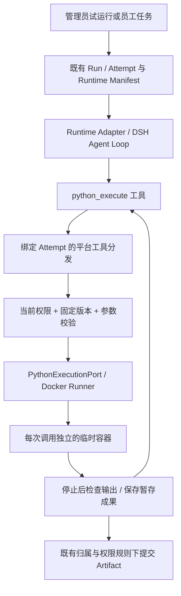

# Skill Python 脚本执行方案

**状态：** 方案设计完成，待实施；本文不代表脚本安装、隔离执行或目标服务器验收已完成。
**范围：** 将已有 Skill 中的 Python 脚本接入统一 DSH 链路，覆盖安装、依赖、权限、试运行、发布、执行、成果和运维。
**关联：** [Skill 安装方案](skill-installation-plan.md)、[当前安装实现](admin-skill-installation-implementation.md)、[架构总览](../development/overview.md)、[内部端口](../development/internal-ports.md)。

## 1. 目标与关键决策

让管理员安装包含 Python 的已有 Skill，完成依赖匹配和真实试运行后，供获授权的 Agent 处理文件、执行计算并交付成果。首个验收场景为：读取订单 CSV/XLSX，按物料汇总数量，输出 CSV/XLSX 与简短说明。

1. 安装和执行分离。安装只下载、检查和保存包，不执行 Python、setup.py、构建脚本或安装钩子。安全检查通过但依赖未满足的包可以保存为草稿，不能试运行或发布。
2. 首期执行入口仅来自已安装、版本固定的 Skill Python 文件；不接受模型提交的源码、解释器路径、镜像名称、挂载路径或 Shell 命令。
3. DSH 仍是唯一 Agent Loop。平台实现确定性 Python 工具和隔离 Runner，复用 Run/Attempt、调度、取消及恢复；Runner 不接触模型 API，也不维护对话循环。
4. 隔离方案选用已有 Mac mini Docker Desktop 环境中的临时 Linux 容器。一个工具调用对应一个新容器，调用间不共享可写目录。宿主 Python、venv、Python `-I` 均不作为安全隔离替代方案。
5. 使用平台构建、按 digest 固定的 Python 环境镜像。运行时禁止联网安装依赖；首期提供标准库环境和表格处理环境，后者包含经过锁定的 pandas/openpyxl 及依赖。
6. 脚本只能读取明确授权并复制到调用目录的文件及固定 Skill 包，写入受限输出区。容器不挂载整个 Workspace、DSH_HOME、应用目录、数据库配置或 Docker socket。
7. Python 可以写任务输出，但不能写企业业务系统。平台需显式支持“任务目录写入”能力，不能靠把 Python 标为只读工具绕过现有校验。
8. 发布必须同时满足依赖匹配、权限配置、真实脚本执行证据及管理员验收。DSH 只返回一段说明、或进程退出码为 0，均不足以认定业务效果合格。

### 首期支持边界

| 项目 | 首期范围 |
| --- | --- |
| 来源 | 复用已实现的管理助手公共 HTTPS/GitHub、受支持 npx/curl 来源；ZIP 实装保持独立批次，完成后共用解析器 |
| 包文件 | 保留现有文本类型，增加 UTF-8 `.py`、requirements 文本、声明性 pyproject.toml/锁文件；不丢弃包内不支持文件后冒充完整安装 |
| 脚本 | 执行包内明确登记的 `.py` 入口，允许读取同包 Python 模块；禁止源码字符串、`-c`、任意 `-m` 和用户自定义解释器 |
| 输入 | 当前会话中明确授权的 CSV/XLSX 原始文件；其他现有文本输入可继续使用。PDF/DOCX 专项解析和包内二进制模板后续适配 |
| 输出 | TXT/Markdown/JSON/CSV/XLSX；只接受普通文件，并执行格式、大小及安全检查 |
| 依赖 | 平台预装镜像匹配；支持解析常见声明，不安装包、不执行依赖元数据生成；VCS/本地路径依赖、任意 index、sdist、原生构建阻塞就绪 |
| 非目标 | 任意终端、动态代码生成执行、网络访问、企业系统写入、GPU、长期后台任务、多主机调度、第三方自带镜像 |

对不兼容入口或依赖，显示具体原因。可以保存受支持文件类型构成的原包草稿供处理，但不得自动改写脚本或假定其可运行；无法安全保存的格式整体拒绝。

## 2. 当前实现及必须补齐的部分

以下来自当前源码核查，与目标方案区分：

| 当前实现 | 目标改动 |
| --- | --- |
| Skill 包解析拒绝 `.py`，文件总量 64 个/1 MB，版本 manifest 内联 UTF-8 文件 | 引入包格式 v2、Python 入口和运行配置；增量迁移，保留 v1 读取和摘要算法 |
| 仅允许 read/glob/grep，普通 Agent 工具要求 `mode=read` | 新增 `python_execute` 固定版本和 `task_output` 执行效果分类，更新全部校验及界面 |
| 平台工具桥接仅服务管理端安装，且不接受工具参数 | 扩展为绑定 Attempt 的工具分发，仅注册 manifest 允许的工具并校验各自 Schema |
| Runtime Manifest 的 file_mounts 主要保存解析文本；资源写入 DSH 工作目录 | 新增原始文件版本引用和授权暂存流程，不能把抽取文本改名为 `.xlsx` |
| Skill 包试运行已走 DSH，但成功判据主要是 Run 成功且有回答；Agent testAgent 仍是配置检查 | 增加真实 Python 调用证据、成果检查及人工验收指纹；Agent 配置检查仍明确标注其性质 |
| 当前 Runtime 建立 output 目录，但没有通用脚本输出收集器 | 新增受控收集与事务化 Artifact 发布，复用现有归属与下载鉴权 |
| 管理会话没有 Workspace | 管理测试文件/成果使用 owner-only 暂存对象，不写入员工 Workspace；必要下载走 Admin API |
| 连接器检查主要判断 Runtime 目录和适配器状态 | 为 Python 环境增加实际容器自检、依赖检查、状态时效和调度健康 |

## 3. 用户流程与交互

### 3.1 安装与依赖确认

提供已有 Skill 来源 → 下载与包安全检查 → 展示实际包清单 → 展示 Python 入口及缺失依赖 → 确认保存草稿 → 处理运行配置 → 真实试运行 → 查看成果并验收 → 发布。

安装卡增加“脚本与运行环境”区块，展示脚本路径、Python 需求、匹配环境、依赖缺口及实际申请权限。技术摘要可展开查看；不展示容器命令、宿主路径或凭据。

- 安全校验失败：禁止保存，显示文件和原因。
- 包安全但依赖/入口未解决：按钮为“保存草稿”，明确“依赖未满足，暂不能运行”。
- 匹配完成：显示“可试运行”，安装成功文案仍只表示已保存。
- 安装助手只能解释检查结果；不能触发脚本执行、自动补写代码、安装依赖或批准发布。

### 3.2 Skill 中心

沿用现有列表与详情，增加“执行要求”和“验证状态”；包版本状态、依赖状态、环境健康分别展示，避免把暂时离线写成永久依赖缺失。

管理员在运行配置中选择包内入口、平台环境以及参数规则；这是一份平台覆盖配置，不改变原始 Skill 包。多入口显式配置，不能仅凭扫描到多个 `.py` 文件就认定都是执行入口。依赖声明缺失时显示“未声明”，要求选择环境并真实验证，不根据源码 import 扫描宣称完整兼容。

配置变化立即使原验收失效；已发布版本只能创建新草稿配置。原包、覆盖配置及各自摘要可查看。

### 3.3 试运行与发布

使用受控测试文件，DSH 发起 Python 工具调用，展示结构化结果、错误分类和可下载成果。管理员确认业务输出后发布，不增加与工具授权重复的每次执行弹窗。

对于每个配置入口，保存至少一次实际执行成功的测试证据；声明必须产出文件时，必须通过成果存在及格式检查。管理员负责计算口径和业务正确性验收。失败、取消、只有回答但无脚本调用均不能通过。

纯文本 Skill 保持原路径。脚本型 Skill 的验收指纹覆盖包摘要、运行配置、入口、工具版本、镜像 digest、依赖锁摘要、策略版本及测试输入摘要；环境变更需新版本/重测，不能使用浮动镜像沿用旧结果。

### 3.4 Agent 与员工端

Agent 能力选择显示“Python 脚本：读取已授权输入、生成本任务成果；不联网”。同时校验 Agent 角色、数据范围、Skill 依赖和 Workspace 授权。员工临时选择一个 Skill 也不能绕过 Agent 工具限制。

员工沿用现有对话、运行状态、取消和成果卡片。用户无需输入 Python 命令或宿主路径。环境不可用给出明确错误；未开放写权限的审计员只查看，不渲染安装、配置、测试、发布按钮。

## 4. 技术架构



`PythonExecutionPort` 为确定性内部端口，提供 execute/cancel/inspect/cleanup/health，不扩展为独立 Agent 服务。Node 通过固定可执行文件及参数数组操作 Docker，禁止 shell 拼接；只有可信平台代码访问本机 Docker 控制面。

### 4.1 DSH 工具契约（拟新增）

`python_execute@1.0.0` 的模型输入：

```json
{
  "skill_version_id": "固定在当前 Attempt 中的版本标识",
  "entrypoint_id": "已登记的入口标识",
  "input_file_ids": ["当前任务可访问的文件标识"],
  "parameters": { "group_by": "material_code" }
}
```

参数由入口配置的 JSON Schema 校验，禁止额外字段，并限制深度、字符串长度和整体大小。平台确定调用 ID、身份、镜像、容器名称、目录及资源限额。调用 ID 来自 ACP tool call 标识，模型不能传入覆盖值。

平台为已有脚本配置两种固定调用方式：声明式 argv 模板或 JSON stdin。argv 只接受固定常量、经 Schema 校验的参数以及平台生成的输入/输出路径；不做 Shell 展开。目录由平台生成并按输入索引映射，模型不能传绝对宿主路径。不能适配的交互式或隐含目录约定阻塞就绪，不由助手改写脚本。

结果返回 execution_id、状态、退出码、截断标记、限长 stdout/stderr、耗时和通过检查的暂存成果引用。日志与文件内容是可能敏感的业务数据，只进入获授权会话；审计不保存正文。脚本结果为不可信工具输出，不能授予新权限。

### 4.2 包、入口和导入行为

包中的 Python 一律视为不可信代码。入口必须是 manifest 列出的普通 `.py` 文件，路径和内容摘要每次暂存时重验。扫描 import 仅作提示，不能执行包来获得依赖清单。

计划使用 Python 3.12 系列，精确补丁版本和镜像 digest 由第一阶段锁定并验证，本文不虚构镜像制品。可信镜像内 launcher 以 `python -I -B` 启动，然后显式添加只读 Skill 根目录/入口目录到模块搜索路径，以支持包内导入。`-I` 默认移除脚本目录等搜索路径，不能直接加参数后假定现有 Skill 导入仍可用。[Python 官方说明](https://docs.python.org/3.12/using/cmdline.html)

禁止把 Python `-I`、AST 检查或字符串黑名单当作安全边界。脚本仍可能通过 Python 标准库派生子进程；这些进程必须继承容器隔离和资源限制，统一终止回收。首期“不提供 Shell 工具”不等于宣称包内代码绝对不能调用 Shell。

### 4.3 隔离与限额

以下为首期默认策略，必须在目标 Mac mini 上验收后写入版本化策略；不能由模型或包修改。

| 项目 | 设计值/约束 |
| --- | --- |
| 生命周期 | 一个调用一个容器；最多运行 60 秒，且不超过 Attempt 剩余时间；排队计入 Attempt 超时 |
| 用户与系统 | 非 root；只读根文件系统；cap-drop=ALL；no-new-privileges；默认 seccomp，不允许 privileged、host PID/IPC/network |
| 网络 | network=none，无端口；不挂载 Docker socket、服务凭据、SSH agent 或宿主 home |
| CPU/内存/进程 | 1 CPU、512 MiB 内存、memory-swap 与 memory 相同、64 PID；禁止自动放宽 |
| 并发 | 单机全局最多 2 个 Python 容器，每个 Attempt 最多 1 个；使用数据库槽位约束，禁止无限启动 |
| 输入与包 | 输入当前调用最多 5 个、合计 20 MiB；Skill 包只读；首期包上限 512 文件/16 MiB，来源下载 20 MiB/归档解压 32 MiB 上限沿用 |
| 可写空间 | 一个有容量上限的 tmpfs 工作区 64 MiB，包含 output/tmp；noexec/nosuid/nodev。noexec 不等于禁止 Python 解释执行 |
| 输出 | 普通文件最多 20 个、单个 10 MiB、合计 20 MiB；目录遍历最多 1024 项，超过整体拒绝 |
| 日志 | stdout/stderr 合计最多 64 KiB，流式消费并截断；禁用无限 Docker 日志落盘 |
| 取消 | 平台先标记取消、发送停止信号，最多 3 秒后强制清理容器；确认进程停止后才释放槽位 |

Docker 支持上述只读、网络、权限和资源控制；这些选项仍须组合验证，不构成绝对隔离承诺。[Docker 运行参考](https://docs.docker.com/reference/cli/docker/container/run/)

容器运行在 Docker Desktop 的 Linux VM 内，VM 内容器共享内核。Docker 控制权限仅由可信平台 Runner 持有；不向 DSH 或脚本开放。当前选型适用于企业内受治理 Skill，若未来允许大量匿名不可信代码，应先评审更强隔离，而非扩大该配置适用范围。[Docker 安全边界](https://docs.docker.com/engine/security/)

### 4.4 容量受限输出的收集方案

首期不把宿主输出目录可写挂入容器，避免绕过磁盘额度。可信 launcher 在脚本结束、子进程全部停止后枚举 tmpfs 输出，以有长度前缀的固定协议流式回传，父进程严格校验路径、文件类型、大小、数量和摘要。该协议本身也按不可信输入解析，脚本即使仿造结果也不能绕过服务端校验。

Docker 不使用自动 remove：平台先等待输出收集与退出证据，再显式 remove。tmpfs 输出在容器停止后不可依赖，因此 launcher 在容器仍存活、脚本树已停止时传输；取消/超时则直接销毁，不尝试发布部分成果。第一阶段必须证明这个收集流程能正确处理大文件、子进程和协议截断，否则不得放开脚本安装。

## 5. 依赖与环境治理

环境注册表由平台发布维护：环境 ID、Python 版本、架构、镜像 digest、依赖锁摘要、实际安装清单、策略版本和生命周期状态。模型和 Skill 不能选择任意镜像或镜像仓库。

首期环境：python-base（标准库）、python-tabular（pandas/openpyxl 及锁定依赖）。受控 CI 中构建镜像，安装使用精确版本与哈希，生成安装清单、来源证明及扫描报告；运行宿主只接收已批准 digest。新增依赖须发布新环境，不能进入正在运行的容器执行 pip。

依赖解析匹配 Python 约束、包名、版本范围和目标架构；声明不支持、缺失或冲突均形成结构化 blockers。requirements 中的索引覆盖、URL、VCS、editable、本地路径和构建钩子不执行。pyproject 只读取声明性依赖，不调用 build backend。管理员可选匹配环境，不能通过“忽略依赖”强制发布。

环境有 enabled/draining/disabled/revoked 管理状态，健康另用 healthy/degraded/offline 与 checked_at 表示。每 30 秒运行无模型、无用户文件的固定容器自检（Python 启动、固定模块 import、临时写入、退出回收），60 秒未更新视为过期，暂停新 Python 调用。队列饱和单独展示，不因满负荷把全部工具标记故障。

一般离线停止新调用，不保证正在运行的计算立即停止；管理员紧急停用工具或撤销镜像时必须主动取消受影响调用。只停止 Python 能力，纯文本 Agent 继续按其依赖运行。

## 6. 数据、内部契约和 API 变更

以下是拟实施设计，当前不修改生产 Schema 或 API。

### 6.1 数据对象

| 对象 | 计划字段与不变量 |
| --- | --- |
| skill_versions.manifest v2 | 原始包摘要、文件清单、运行配置摘要、入口、依赖要求；包和覆盖配置分别保存；发布后不可变 |
| python_execution_profiles | 固定镜像、Python/依赖锁、架构、策略版本；状态及健康独立更新，不改已固定制品 |
| skill_validation_runs | 固定测试指纹、Run/Attempt、每个入口执行证据、成果校验、人工接受人/时间；不能覆盖历史结果 |
| tool_executions | tenant/run/attempt/call 唯一键、skill版本、镜像、状态、container标识、取消原因、退出码、摘要、时间；不保存凭据 |
| execution_output_files | execution/file唯一键、暂存存储键、类型、大小、摘要、提交状态；通过现有 Artifact 关联正式成果 |
| admin_test_files | 管理员所有权、固定版本、存储键、大小、摘要和清理时间；员工 API 不可读 |

包资源建议从内联内容扩展为平台受控、按内容摘要存储的 blob 引用，以避免大包重复进入 manifest。保留 v1 原摘要及读取方式；不得重算历史摘要或批量改写已发布版本。v2 暂存时重新校验 bytes/hash，归档原始包不执行。存储先暂存、事务提交引用后转正，失败文件由幂等清理回收。

### 6.2 Runtime Manifest 与授权

新增可选的 execution_capabilities、原始文件版本引用及受控挂载描述，明确 schema 版本兼容；无 Python 的旧 manifest 可继续运行。快照固定 Skill/Tool/环境/策略及输入版本，不包含 Docker socket、真实宿主路径或凭据。

每次工具调用重新检查：当前 Attempt 是否有效、Run 是否取消、用户当前权限、Workspace 状态/成员关系、Agent/Skill/Tool 是否可用、文件归属及版本、环境是否被撤销。禁止仅依赖启动时快照。快照决定“能用哪个版本”，当前授权决定“现在能不能用”。

将当前 read-only 工具 gate 改为枚举式执行效果：read_only、task_output；只允许 python_execute 的固定实现使用 task_output。企业系统 write 仍拒绝。同步 Tool 服务、授权服务、Agent/Skill 校验、管理 DTO、Manifest 策略和数据库约束，避免只改一处字符串。

### 6.3 HTTP 与前端接口

沿用管理助手安装及 Skill 安装确认接口，在真实预览中增加 fileKinds、entrypoints、dependencyStatus、blockers 和 requiredCapabilities。安全失败不可确认，依赖不足可确认保存草稿。

拟增加：Skill 草稿运行配置读写；环境只读列表；异步启动/查询/取消 Skill 验证；管理员测试文件上传下载。管理验证采用 202 + Run ID 和状态查询，避免把多入口测试塞入一个长 HTTP 请求。路径和 DTO 在实施批次的 OpenAPI 中统一确定，禁止先落不一致的前端私有接口。

现有发布接口保持入口，增加验证指纹及管理员接受检查，在同一锁/事务中验证当前草稿未变化。员工端只增加必要工具状态与成果反馈，不开放 Python HTTP 执行入口。Python 调用仅来自当前受控 DSH Attempt。

## 7. 状态、取消、恢复及成果一致性

工具调用：queued → starting → running → collecting → succeeded；任意活动状态可转 failed/cancelled，终态不可回退。失败分类至少包含 INPUT_INVALID、DEPENDENCY_UNSATISFIED、ENVIRONMENT_UNAVAILABLE、PERMISSION_REVOKED、TIMEOUT、OOM、OUTPUT_LIMIT、SCRIPT_FAILED、COLLECTION_FAILED。

同一 Attempt+call ID 重放返回已保存结果，不重复执行；同键不同参数摘要拒绝。DSH 发起新 call ID 属于新的受限工具调用，不做隐式业务重试。用户重试 Run 创建新 Attempt，旧容器和迟到结果不能写入新 Attempt。

- 数据库先记录 starting 与平台生成的容器名称，再启动容器；记录与容器通过所属部署、Attempt、调用标签关联。
- 取消/停用先更新数据库取消标记，阻止新调用并终止活动容器；Docker 不可达时保留 cleanup_pending 和占用槽位，不能假称清理成功。
- 服务重启时按数据库和容器标签核对，仅清理本部署所有的孤立容器，不扫描并删除其他应用容器；活动调用失败收敛，不能恢复执行旧 Python 指令。
- 暂存成果仅在来源调用成功、Run 成功且未被取消/撤权后提交，提交前再次鉴权。取消与提交按 Run 锁串行化，避免取消后仍发布成果。
- 一个 Run 的成果集合提交需幂等；对象存储先暂存、数据库原子记录 Artifact/版本/关联再转正。失败不能生成断链下载，也不能因重试重复发布。
- 管理测试成果仅对测试发起管理员可见，默认保留 24 小时；成功员工成果进入既有保留策略。失败调用输入/临时输出默认立即清理，清理失败重试并告警。

输出校验在脚本及所有子进程停止后进行，拒绝 symlink、hardlink、多路径冲突、设备、FIFO 和越界路径；文件按实际签名和类型校验，XLSX 不接受宏格式、异常压缩和外链能力绕过。服务端生成存储键及下载头，HTML/脚本不在前端直接执行。扫描服务不可用时成果保持不可下载的待检查状态，不降级为直接发布。

## 8. 部署与发布安排

沿用宿主 Node + PostgreSQL + 独立 DSH Worker；Python 容器为新增执行依赖，不改变 DSH 部署职责。Mac mini 使用原有 Docker Desktop，但只复制当前调用文件，不挂入 AI Hub/数据库卷，评估 VM 总容量对现有服务的影响。

发布制品增加 python-runtime-lock.json、可信 launcher、Runner 策略和镜像来源信息。首期限定 linux/arm64；CI 可在其他架构验证纯契约，真实容器验收必须覆盖目标 arm64。精确镜像与依赖由阶段 P0/P1 产出；生产运行时不自动构建或拉取浮动 tag。

使用显式功能开关，默认关闭。先部署数据/读取兼容，再准备镜像并执行自检与真实 DSH 验收，最后开放脚本安装与授权。试点只给指定角色和示例 Skill；不自动修改任何已有 Agent 权限。

回滚先禁止新 Python 调用、排空或取消、确认容器清理，再回退应用；保留 v2 包和执行审计。只允许回到已具备 v2 安全读取并能明确拒绝执行的兼容版本，不能让旧程序把 Python 包当成已验证文本包发布。被撤销镜像即使仍有历史版本引用也禁止新执行。

## 9. 实施批次与验收门槛

| 批次 | 交付内容 | 退出条件 |
| --- | --- | --- |
| P0：执行可行性 | 精确镜像/依赖候选、容器 Runner 原型、可信 launcher、DSH 工具调用、tmpfs 成果收集 | 目标 Mac mini 真实 DSH 读取固定输入运行固定脚本并返回正确文件；验证隔离、导入、取消/子进程回收、输出传输；不放开普通安装入口 |
| P1：执行基础 | PythonExecutionPort、工具分发、调用记录、配额、依赖环境、自检、原始文件授权暂存 | 同步 Tool/权限/Manifest 契约，重复调用和重启恢复通过；无法隔离时明确拒绝，无宿主执行回退 |
| P2：包安装与治理 | v2 存储、Python/依赖解析、运行配置、兼容迁移、安装预览和依赖状态 | 原包字节及摘要可读回；不执行安装代码；缺依赖可保存草稿但不能运行/发布；历史 Skill 不受影响 |
| P3：验证与成果 | 异步 DSH 试运行、每入口证据、成果收集/鉴权/事务、发布门槛 | CSV/XLSX 样例真实计算及下载通过；仅生成回答不能通过；取消和撤权不发布成果；包/环境变化使验收失效 |
| P4：Agent 使用与上线 | Agent 显式授权、员工结果反馈、运维/审计、功能开关、部署/回滚手册 | 测试角色端到端验收、目标并发与限额实测、容器无泄漏、已发布版本固定及回滚演练通过后开放 |

不采用“先仅移除 .py 限制上线”的捷径；P0/P1 是放开能力的前置条件。ZIP 实装、Agent 对话管理及 Agent 全面评测不是该方案自动附带范围，但不得让这些入口绕过脚本型 Skill 的发布与授权检查。

### 必须覆盖的验收用例

| 领域 | 场景与预期 |
| --- | --- |
| 正常路径 | 同包模块导入、中文文件名、CSV/XLSX 输入、确定性统计结果、正确成果格式与摘要 |
| 安装 | 多入口、无依赖声明、缺依赖、版本冲突、恶意 setup.py、Python 存在但未被引用、损坏 ZIP、路径穿越；不执行任何安装内容 |
| 权限 | 未授权 Python、跨 Workspace/跨管理员文件、已移除成员、已归档空间、停用 Skill/Tool、撤销镜像；新调用拒绝，活动调用按策略取消 |
| 隔离 | 宿主路径/凭据/socket 不可读，私网与公网均不可达，输入和 Skill 只读；Fork/OOM/死循环/输出洪泛受限 |
| 取消恢复 | 排队和执行中取消、Node/DSH/Docker 崩溃、断连、迟到结果、重复 call、取消与成果提交并发；状态收敛且无孤立容器 |
| 输出 | symlink/hardlink/FIFO、深目录、超量文件、假扩展名、宏/恶意 XLSX、协议伪造/截断；拒绝危险结果且无宿主越界写入 |
| 生命周期 | v1 升级读回、v2 摘要、试运行失败阻止发布、配置/环境变更重测、固定旧版本及停用/回滚、只读用户入口 |
| 资源与环境 | 2 并发与排队、60 秒超时、容量和磁盘恢复、自检过期、镜像缺失/架构不符；不能宣称未实测的吞吐量 |

工程门禁：现有 pnpm ci:check；新增来源/包/Runner/策略单测、可丢弃 PostgreSQL 安装与授权集成测试、前端交互测试、隔离容器安全回归；真实 DSH 与目标 Mac mini 验收独立记录。执行实现阶段同步 OpenAPI、Runtime Schema、数据迁移、测试脚本和 CI，不能只更新产品文档。

## 10. 实施时的文件映射

- 安装解析与治理：server/src/modules/skill/skill-package.ts、admin-skill-installation-service.ts、postgres-skill-service.ts。
- 工具登记与授权：server/src/modules/tool/、server/src/modules/authorization/、server/src/modules/agent/ 及新增迁移。
- 执行与恢复：server/src/modules/runtime/ 新增 Python Runner/端口，扩展 platform-tool-bridge.ts、dsh-acp-runtime-adapter.ts 和 server/config/dsh/dsh-work-tool-policy.js。
- Run/成果：server/src/modules/run/ 与 server/src/modules/workbench/application/；管理员暂存对象经 Admin Audience 访问。
- 管理交互：SkillPackagePreview.vue、CapabilityManagementView.vue、AdminAssistantView.vue、工具/连接器 DTO 与 Store；复用现有壳层、Token、表格和状态组件。
- 部署与契约：deploy/、scripts/deploy/、scripts/ci/、docs/contracts/；所有新增配置和命令在落地后进入部署手册。

## 11. 设计验证与待实测事项

已核查当前包解析、工具映射/只读门槛、DSH 注册与安装桥接、文件 Manifest、试运行判据和部署形态，并对照 Docker/Python 官方约束完成设计。

仍须在 P0 以真实环境确认：镜像精确版本/架构、Docker Desktop 配额效果、模块导入兼容、脚本子进程收敛、tmpfs 流式收集、XLSX 安全校验和整条 DSH 工具回传。本文给出明确选型与退出条件；未将这些待实测项目描述为当前能力。
